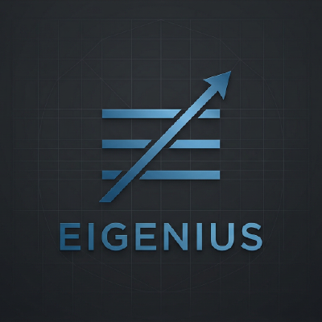

<p align="center">
  
</p>

# Eigenius

<p align="center">
  <a href="https://github.com/eigenius/eigenius/actions/workflows/ci.yml"></a>
  <a href="LICENSE"></a>
  <a href="docs/"></a>
</p>

An open-source platform for **verifiable AI in science and engineering**, built on a typed, versioned knowledge graph.

Modern language models can produce convincing text without producing trustworthy knowledge. Eigenius is a substrate for representing what the science actually says: typed resources with tracked provenance, replayable derivations, and — where the claim warrants it — machine-checked formal proofs.

The platform distinguishes four kinds of knowledge, each with stronger guarantees than the last:

- **Declared** — a human asserts it.
- **Observed** — measured or recorded with provenance.
- **Derived** — produced by a typed pipeline whose steps are auditable.
- **Verified** — derived *and* re-checked by a formal proof system (Lean 4 today).

When a result matters — a clinical trial conclusion, a materials-property prediction, a regulatory submission — you can tell what has been verified end-to-end versus what's plausible-sounding text without grounding.

Theoretical foundation: dependent type theory + Grothendieck institutions, integrating different formal logics and scientific disciplines under one typed substrate. [Eigenius: A Typed Knowledge-Graph
DBMS with Epistemic Stratification
and Institution-Mediated Reasoning](https://arxiv.org/abs/2608.04457) sketches the academic framing.

> This is still a very early stage of this project. Anticipate
> features not working or missing functionality overall. Our goal
> is to close those quality gaps rather aggressively. Feel free
> to submit issues in the discussion forum or directly as issue.

## Quick start

The fastest path is the Docker Compose stack (no Rust or Deno needed on the host):

```bash
# Mock LLM, no API key needed:
EIGENIUS_MOCK_LLM=true docker compose up --build -d

# Open the notebook
open http://localhost:8080/notebooks/   # macOS; xdg-open on Linux

# Run the end-to-end CLI demo
./demo/run.sh

# Drive the platform from an LLM agent (Claude Code / Desktop / Cursor / ...)
claude mcp add --transport http eigenius http://localhost:8080/mcp
```

The first build takes a few minutes. Subsequent ups are fast. See [Docker Compose](#docker-compose) below for state inspection, logs, and `ANTHROPIC_API_KEY` setup, [MCP server](#mcp-server-for-llm-agents) for the agent surface, or [Getting Started](#getting-started) for a native-toolchain build.

**What Eigenius gives you, today:**

- **Typed, versioned knowledge graph** — immutable layers with content-addressed IDs, branches/tags/merges, conflict resolution with on-chain provenance, garbage collection. ([D23](docs/design/d23-out-of-core-layer-architecture.md), [D20](docs/design/d20-layer-reconciliation.md))
- **Five live Julia institutions** for scientific computing — [Symbolics](https://juliasymbolics.org/), [IntervalArithmetic](https://juliaintervals.github.io/), [Catalyst](https://docs.sciml.ai/Catalyst/stable/), [DifferentialEquations](https://docs.sciml.ai/DiffEqDocs/stable/), and [JuMP](https://jump.dev/) — sharing a typed `FormulaTerm` representation, with cross-institution comorphisms (Catalyst→DiffEq, Symbolics→JuMP). ([D27](docs/design/d27-julia-institutions.md))
- **Lean 4 verification institution** — proof terms commit as chain resources; the kernel re-checks them in-process via [`nanoda_lib`](https://github.com/ammkrn/nanoda_lib) and lands a typed `Verdict` resource so *verified* is itself queryable. ([D28](docs/design/d28-lean-4-as-institution.md))
- **Native dependent-type surface** — EigenTT carries an impredicative `Prop` universe with proof irrelevance, indexed inductive families with first-order pattern unification, and a chain-mirrored type fragment that lets axiom statements, propositions, and dependent motives round-trip as content-addressed chain artifacts. Authorable directly in ESL via `axiom`, indexed `data`, and `match … returning fun (i : T) => body`. ([D46](docs/design/d46-prop-universe-and-proof-irrelevance.md), [D47](docs/design/d47-chain-mirrored-eigentt-type-fragment.md), [D48](docs/design/d48-indexed-inductive-families.md))
- **Typed program execution** with full reasoning traces, memoization, four epistemic categories enforced by the ontology, and an LLM dispatch surface (Anthropic via Vercel AI SDK, structured output via `CompleteJson`).
- **Notebook, CLI, and TypeScript SDK** — author and run cells (ESL, EigenQL, TypeScript, programs, charts) in the browser; drive the kernel from the shell; embed it from any TS runtime via [`@eigenius/client`](clients/eigenius-ts/). ([D22](docs/design/d22-notebook-and-typescript-sdk.md))
- **Runtime substrate** — heavy native libraries (SAT solvers, ODE integrators, theorem provers) hosted in sibling containers with content-addressed images and pinned environments, plus a generic `oci` tool runtime that runs any pinned containerized tool as an attested, replayable derivation with a kernel-tracked build recipe. ([D26](docs/design/d26-runtime-substrate.md), [D60](docs/design/d60-native-runtime-and-tracked-env-build.md))

## The notebook — start here

For most users, the notebook is the most accessible way to use the platform. It is a React SPA the orchestrator serves at `http://localhost:8080/notebooks/`; cells run ESL, EigenQL, TypeScript, and program invocations against the live kernel; outputs auto-render as typed inspectors, result tables, layer-stack diagrams, and program-trace trees.

<p align="center">
  
</p>

If you have the docker stack up (`docker compose up -d`), the notebook is already there — it's bundled into the orchestrator image at build time and serves alongside the RPC paths on the same origin. Open the URL above and the patent-analysis demo loads on first mount; click **Run all** and watch ESL compile + commit a layer, EigenQL produce a result table, and the program-run cell drive the kernel through a two-step LLM pipeline (`CompleteJson` → structured patent analysis, `CompleteText` → plain-language summary) with the resulting brief and an interactive trace tree rendered side-by-side.

See **[chapter 14 — Notebook](docs/guides/platform/14-notebook.md)** for the full reference. The most comprehensive worked example is
[`kinase-institutions.json`](notebooks/examples/kinase-institutions.json) — a three-part walkthrough that authors a flat kinase screening dataset (24 IC₅₀ measurements across 6 compounds × 4 targets), renders it across every Fluent chart kind, and then lifts the same domain to typed reasoning via Catalyst → DiffEq and Symbolics → JuMP comorphisms. Run the [setup script](notebooks/examples/kinase-institutions-setup.sh) once before opening it.

For collaborative chain work, **[chapter 15 — Tags, branches, and history](docs/guides/platform/15-tags-branches-history.md)** covers the workspace rail's chain destinations (Branches, Tags, History) and the time-travel read-pin, and **[chapter 16 — Merge resolution](docs/guides/platform/16-merge-resolution.md)** covers folding one branch into another when contributions conflict: the six-state flow, the four strategies (Witness / Rename / SchemaQuotient / Restructure), the cascade gate, and chain-resident provenance records.

The same SDK that powers the notebook ([`@eigenius/client`](clients/eigenius-ts/)) is usable programmatically from any TypeScript runtime — see **[chapter 17 — TypeScript SDK](docs/guides/platform/17-typescript-sdk.md)**.

## User guides

Four task-first guides plus a consolidated bibliography, all grounded in the implementation:

- **[Platform user guide](docs/guides/platform/README.md)** — chapters on operating the platform: installation, build, CLI reference, running locally, database management, the orchestrator, end-to-end demos, the runtime substrate (Julia v1) with per-institution slow-walks, deployment, troubleshooting, **the notebook UX**, **tags / branches / history**, **merge resolution**, **the TypeScript SDK**.
- **[ESL — Eigenius Surface Language](docs/guides/esl/README.md)** — eleven chapters on the declarative surface (`namespace`, `class`, `property`, `resource`, `axiom`, `def`, `data`, `codata`, `program`) and the ML-style expression sublanguage. Most important chapter: [chapter 6 — Resources, types, and the layer](docs/guides/esl/06-resources-types-and-the-layer.md), the bridge between the resource graph and the kernel's type theory.
- **[EigenQL — query language](docs/guides/eigenql/README.md)** — twelve chapters on pattern matching, derived relations, expressions, `FIBER` institution dispatch (with `INTO`-pinned chain reinsertion), stratification, and the result-document format.
- **[Formula language](docs/guides/formula/README.md)** — eight chapters on the chain-mirrored EigenTT fragment (`urn:eigenius:formulas:FormulaTerm`) shared by every numerical institution: Symbolics, IntervalArithmetic, Catalyst, DiffEq, JuMP-HiGHS. Covers the six-constructor inductive, Eigon-JSON encoding, operator catalog, the ESL `formula(...)` Pratt-parsed sublanguage, and identity-comorphism collapse across institutions.
- **[References](docs/guides/references/README.md)** — consolidated bibliography for the platform: works actually cited in design docs / papers / guides, foundational works the system relies on, philosophical and methodological precursors, and contemporary related work. Generated from the BibTeX files in [`docs/references/`](docs/references/) by `scripts/bib-to-md.py`; verified against Crossref / arXiv / live URLs by `scripts/verify-citations.py`.

Guides landing page: **[docs/guides/](docs/guides/README.md)**. Full documentation index (guides + design documents + papers): **[docs/](docs/README.md)**.

## Status

The platform is operational end-to-end: kernel, orchestrator, LLM integration, and CLI connected via gRPC. Phases 0–11e are complete, plus the notebook + SDK (D22), institution realisation (D14), runtime substrate (D26 / D29 / D31), formula language (D32), and the Lean 4 verification institution (D28 / D30 / D40).

<details>
<summary>Full capability inventory (what the system can do today)</summary>

The system can:

- Parse and serialize Eigon-JSON and CBOR documents
- Load the self-describing core, program, reflection, and institution ontologies (4 bootstrap layers)
- Build immutable layers with content-addressed identifiers (SHA-256 of CBOR)
- Validate resources against the full ontology constraint system (12 validation rules)
- Resolve resources through parent-pointer layer chains
- Query the knowledge graph with EigenQL (typed stratified Datalog with aggregation)
- Type-check programs using EigenTT dependent type theory (NbE evaluator)
- Execute programs with local and remote IO components (LLM calls via orchestrator)
- Dispatch IO components to the Deno orchestrator via gRPC (ComponentExecutor service)
- Call LLMs via Vercel AI SDK (Anthropic) with prompt templating and metrics
- Generate structured LLM output via CompleteJson (JSON Schema from ontology classes)
- Expose 14 kernel operations as MCP tools (query / inspect / load / run-program / institutions / schema / branches / tags / tasks / topology / health) for LLM agents. HTTP transport at `http://localhost:8080/mcp` when the docker stack is up (point Claude Desktop / Claude Code at the URL); stdio also available via `cd orchestration && deno task mcp` for kernel-on-host development
- Track four epistemic categories: declared, observed, derived, verified
- Record tree-structured reasoning traces with memoization and incremental execution
- Validate epistemic base class requirements (DeclaredResource, DerivedResource, etc.)
- Persist layers, traces, and institution registrations in RocksDB — survives kernel restart
- Serve the kernel as a gRPC service (tonic) with streaming query results
- Compile ESL (Eigenius Surface Language) to Eigon-JSON — all CLI commands accept `.esl` files
- Register Grothendieck institutions with fiber reasoners and morphism validation
- Model coinductive types (codata/streams) and resumable tasks with checkpointing
- Resolve ontology classes as kernel types on demand via the layer chain (Phase 10, D18)
- Type-check inductive types with bounded binders for sized termination, plus self-referential parameterised codata for productivity by typing (Phase 11b, D19)
- Use `Map` and `Reduce` as type-level primitives with structural-recursion termination (Phase 11a)
- Declare institutions, export/import boundary formats, query classes, and triadic comorphisms as ontology resources committed to the layer chain (D14 §3–§5)
- Fire `Decidable` `QueryClass`es at type-check time, returning a `Verdict` projected to the kernel's reduction (`Holds` → `Refl(v)`, `Fails` → failing neutral, `Undecidable` → passthrough) (D14 §9.2)
- Auto-register institutions from layer scan: any `Institution` resource with `runtime: external` (dispatched to the orchestrator substrate) or `runtime: in_process` (linked into the kernel binary) is wired into the dispatch index without an explicit install step (D14 §3, registration code in `kernel/src/capability/registration.rs`)
- Dispatch qualified-name function calls through a single `InstitutionIndex` shared by ESL and EigenQL (D14 §9.5); ESL emits `Exp::NativeDecide` returning `Verdict`; EigenQL adds postfix `HOLDS` / `FAILS` / `UNDECIDABLE` to project to Boolean
- Run cross-institution comorphism coercion inline inside FIBER param values (`param: comorphism_iri(source)`) — a four-step extract → transform → reify pipeline (D14 §9.3)
- Reinsert comorphism reify outputs into the chain as first-class resources (D14 §9.3): ESL programs invoke comorphisms as qualified-name function calls (`comorphisms:foo(input)` lowers to `Exp::InstitutionInvoke`) with output committed at a deterministic content-hash IRI; EigenQL `FIBER ... AS ?var INTO "<iri>"` commits the response at a caller-named IRI
- Host institutions in language-runtime sibling containers via the runtime substrate ([chapter 11](docs/guides/platform/11-runtime-substrate.md), D26/D29/D31): `eigenius mirror create → env build → env create → institution install` lifecycle; mirror generator's closure walker auto-discovers cross-institution classes from `RuntimeMethodSignature.input_types` / `output_type`; long-lived per-image worker pools dispatched via Eigon-CBOR over UDS
- Run five v1 Julia institutions end-to-end ([D27](docs/design/d27-julia-institutions.md), tutorials under [`platform/julia-institutions/`](docs/guides/platform/julia-institutions/)): [`Symbolics`](https://juliasymbolics.org/), [`IntervalArithmetic`](https://juliaintervals.github.io/), [`Catalyst`](https://docs.sciml.ai/Catalyst/stable/), [`OrdinaryDiffEq`](https://docs.sciml.ai/DiffEqDocs/stable/), [`JuMP+HiGHS`](https://jump.dev/) — plus three cross-institution comorphisms (Symbolics → IntervalArithmetic, Catalyst → DiffEq, Symbolics → JuMP) all sharing `formulas:FormulaTerm` as the typed payload
- Verify Lean 4 proofs through the platform's first verification institution ([D28](docs/design/d28-lean-4-as-institution.md), [D30](docs/design/d30-eigon-to-lean-faithful-translation.md), [D40](docs/design/d40-chain-mirrored-lean-expressions.md), tutorial at [`platform/lean-institution/`](docs/guides/platform/lean-institution/)): `LeanProofTerm` resources carry verbatim `lean4export` bytes + a chain-mirrored proposition ([`lean:LeanExpr`](docs/design/d40-chain-mirrored-lean-expressions.md)) + an audit anchor pointing at the `LeanPackageMirror` they were proved against. AutoOnLoad dispatches the three-part correspondence check (D28 §5.5) — proof validity via `nanoda_lib`, mirror correspondence between proposition's `EigeniusFFI.*` references and chain class declarations, anchor-consistency hash. Verification is in-process (no orchestrator round-trip, no IPC) so the verdict is a direct function call inside the kernel binary. The capstone notebook ([`notebooks/examples/lean-verification.json`](notebooks/examples/lean-verification.json)) walks the closed audit chain end-to-end from verdict → proof term → mirror → ontology class
- Author typed expression trees in ESL via the `formula(...)` Pratt-parsed sublanguage (D32) — `formula((x + 0) * 1)` lowers to a chain-resident `FormulaTerm` value that the validator type-checks against an on-chain operator catalog with declared `Pi`-spine signatures
- Run locally via three terminals or Docker Compose
- Drive the platform from a React notebook (six cell types: markdown, ESL, EigenQL, TypeScript, program-run, and form-based chart cells covering grouped-bar / vertical-bar / horizontal-bar / donut / line / area; auto-rendered outputs; layer-stack and per-layer topology graph visualisations; cell-order Run / Run-from-here / Run-to-here with stale markers; collapse/expand; content-addressed publish-to-layer with a queryable Open dialog; bundled into the orchestrator image and served at `/notebooks/`)
- Use the same kernel from any TypeScript runtime via `@eigenius/client` — a typed SDK over the Connect-RPC surface (browser, Deno, Node)

</details>

See [docs/design/implementation-plan.md](docs/design/implementation-plan.md) for the full phased build plan.

## Architecture

Everything in Eigenius is a **Resource** — classes, properties, data types, formats, and instance data are all represented uniformly with IRI identity and typed property values. The core ontology is self-describing: `Class` is an instance of `Class`.

<details>
<summary>Subsystem inventory (kernel, orchestrator, layer system, …)</summary>

- **Rust Kernel** — ontology validation, layer management, resource resolution, program execution, gRPC server. Uses `BTreeMap` for deterministic ordering and cache-friendly access.
- **Deno Orchestrator** — IO component dispatch, LLM integration (Vercel AI SDK), MCP server. Communicates with the kernel via Connect RPC/gRPC.
- **Layer System** — immutable layers with parent pointers (`Arc<Layer>`), forming a chain. Four bootstrap layers: core → program → reflection → institution. Resolution walks the chain top-down.
- **Eigon-JSON / CBOR** — the canonical serialization formats. `@id` is the only reserved key; all property keys are full IRIs. Three-layer type system: primitive data types, format constraints, and content types. CBOR for storage and gRPC wire format.
- **Validation** — 12 rules: required properties, inheritance, type checking, format/pattern validation, range/length constraints, class type checking, allowed values, domain checking, conditional requirements, open-world extra properties. Epistemic base classes enforce provenance requirements.
- **EigenQL** — typed stratified Datalog with aggregation. Supports USING, MATCH (typed/untyped/negated patterns), WHERE, GROUP BY, RETURN (with COUNT/SUM/AVG/MIN/MAX), ORDER BY, LIMIT/OFFSET, DISTINCT, DEFINE (recursive rules with seminaive fixpoint), dot-path navigation, NOT EXISTS. Full pipeline: lex → parse → stratify → type_check → evaluate.
- **Program Model** — programs are typed expressions (Let, Apply, Lambda, Case, Map, Reduce, etc.) that map 1:1 to EigenTT terms. Type-checked via NbE (Normalization by Evaluation) with Eigon ontology types as ground types. IO components dispatched to the orchestrator via gRPC with trace recording and memoization.
- **Epistemic Model** — four categories (declared, observed, derived, verified) enforced via base classes in the reflection ontology. Reasoning traces mirror the expression tree and serve as memoization cache.
- **Grothendieck Institutions (D14)** — domain-specific reasoning systems contribute structured fibres to the knowledge graph. Each institution is *declared* as ontology resources (`Institution`, `ExportFormat`, `ImportFormat`, `QueryClass`, `Comorphism`) committed to the layer chain, and *implemented* via the three-method `Institution` trait (`extract_typed` / `reify` / `query`). Comorphisms are triadic — source-side export + cross-institution EigenTT transformation + target-side import — with optional `exact: bool` Satisfaction-Condition annotation. The category-theoretic Grothendieck construction emerges from declared comorphisms; the kernel provides the dispatch and well-typedness machinery.
- **Runtime Substrate (D26/D29/D31)** — the extensibility surface for out-of-process institutions. Orchestrator-spawned sibling worker containers running full language ecosystems (Julia, R, Lean; Python and others tracked) communicate with the kernel via Eigon-CBOR over UDS. Four chain shapes drive the lifecycle: `RuntimePackageMirror` (auto-generated, content-addressed Julia source mirroring chain classes/inductives), `RuntimeEnvironment` (pinned image digest + runtime version + lockfile), `RuntimeMethodSignature` (typed input/output contracts), `Institution { runtime: external, requires_environment: ... }`. Long-lived per-image worker pools, mirror generator's closure walker discovers cross-institution classes from signature contracts. The right path when an institution wants to use a heavy native library (a SAT solver, an ODE integrator, a quantum-chemistry engine).
- **Generic OCI tool runtime (D60)** — a language-agnostic `oci` runtime that runs *any pinned containerized tool* as a one-shot Job: the substrate provisions inputs by `content_hash`, dispatches `RunRuntimeScript` to the tool in its `image_digest`-pinned image, and the tool returns its result as Eigon-CBOR; the kernel commits it under a `ProgramTrace → IsDerivedAs`, so a downstream reasoning certificate can `derived(result, P)` against it (the WRN wrapped-program pattern, no new institution). The image build goes through `eigenius env build --language oci` and emits a **kernel-tracked `runtime:BuildRecipe`** (base image, baked-artifact hashes, composed Dockerfile, build command, builder version) committed with the `RuntimeEnvironment` — so *how the image was built* is a chain-resident, content-verified fact, not an ad-hoc script. First consumer: the D57 schema.org generator lift — `eigenius run` converts the pinned schema.org vocabulary through the runtime and `concl_generator` discharges its conformance leg as a genuine **Derived** witness.
- **Formula Language (D32)** — `urn:eigenius:formulas:FormulaTerm`, a chain-mirrored fragment of EigenTT lifted onto the chain as an `InductiveType` with six constructors (`Var`, `LitFloat`, `OpRef`, `App`, `Lam`, `Pi`). Lives in the kernel bootstrap layer alongside `core:`, `program:`, `reflection:`, `institution:`, `notebook:`. Every numerical institution consumes the same shape; comorphisms between FormulaTerm-speaking institutions collapse to identity. Operators carry on-chain `operator_signature` (`Pi`-spine), and the validator rank-checks every `App` spine against the operator's signature at commit. ESL `formula(...)` Pratt-parsed surface for authoring; tagged-dict Eigon-JSON for the wire form.
- **Durable State** — `eigenius serve --db <path>` persists layers, traces, and institution registrations in RocksDB. Restart rebuilds running state; embedded ontologies seeded with SHA-256 manifest and drift-refusal.
- **Codata and Tasks** — coinductive types (codata/corecord/observation) for streams. Programs run as tracked tasks with checkpointing, positional trace keys, and startup resume sweep for crash recovery.

</details>

Phase 19 complete (19a–19i): D26 runtime substrate landed end-to-end with the Julia v1 instantiation (D27 — five worked institutions: Symbolics, IntervalArithmetic, Catalyst, DiffEq, JuMP-HiGHS); D29 mirror generator with closure walker; D31 install lifecycle; D32 formula language as EigenTT fragment with the ESL `formula(...)` sublanguage; comorphism chain reinsertion (D14 §9.3) wired through both ESL `Exp::InstitutionInvoke` and EigenQL `FIBER ... INTO`. The kinase-institutions notebook ([`notebooks/examples/kinase-institutions.json`](notebooks/examples/kinase-institutions.json)) exercises the entire stack end-to-end.

Phase 20a complete (20a.0–20a.8): the first verification institution. D28 Lean 4 institution landed end-to-end through the substrate's authoring side (`lean4export` against pinned `LeanEnvironment` images) and an in-process verification side (`nanoda_lib` re-check with axiom-allowlist enforcement); D40 chain-mirrored `lean:LeanExpr` / `lean:LeanLevel` / `lean:LeanName` inductives; D30 faithful translation spec with the substrate `LeanMirrorGenerator` producing baked `EigeniusFFI` Lake packages; three-part correspondence check (D28 §5.5) wired through AutoOnLoad. The lean-verification notebook ([`notebooks/examples/lean-verification.json`](notebooks/examples/lean-verification.json)) walks the closed audit chain D28 §5.7 promises. Phase 20b (Mathlib-scale operational landing per D28 §11.2) is consumer-triggered; not architecturally required.

Type-theory layer 2 landed (D46 / D47 / D48 / eigenius#72): EigenTT now carries an impredicative `Prop` universe with proof irrelevance and a `Sort(n)`-laddered universe (D46), a chain-mirrored type fragment `eigentt:TypeExpr` with a bidirectional `Exp` ↔ `Value::Json` codec (D47, extended by eigenius#71 for term-level constructors), and indexed inductive families with a first-order pattern unifier, dependent constructor checking, per-arm index-coherence, and singleton elimination for propositional indices (D48). The companion `eigentt:Axiom` chain class admits `propext` and `Quot.sound` as kernel built-ins on the same footing. The ESL surface for proposition and indexed-type authoring landed in [eigenius#72](https://github.com/eigenius/eigenius/issues/72) across three layers — `axiom Name : <type-expr>` declarations, `data Vec(A) : Nat -> Set { … }` with index telescopes and typed ctors, and `match … returning fun (i : T) => body` Lambda motives — making the type-theoretic refinements directly authorable. D39 v2 (justification logic) consumes the whole stack: propositions live in `Prop`, the `JustifiedBy` predicate is an indexed inductive over `JustificationTerm`, and grounding witnesses project the reflection ontology's existing class-membership facts into the type system.

See [docs/design/architecture-v0.3.md](docs/design/architecture-v0.3.md) for the full architecture specification.

## Docker Compose

The demo can also run via Docker Compose without installing Rust or Deno locally.

```bash
# Build and start both services (mock LLM, no API key needed):
EIGENIUS_MOCK_LLM=true docker compose up --build -d

# Run the demo:
./demo/run.sh

# With a real LLM:
docker compose down
ANTHROPIC_API_KEY=sk-ant-... docker compose up -d
./demo/run.sh

# Stop:
docker compose down
```

### Inspecting the kernel's persistent state

The kernel writes its RocksDB store to a named docker volume (`eigenius_db`)
mounted at `/var/lib/eigenius/db` inside the kernel container. The volume
survives `docker compose down`; use `docker compose down -v` to wipe it (the
next `up` re-seeds at schema v1).

```bash
# Peek at the on-disk RocksDB files via the running kernel container
docker compose exec kernel ls -la /var/lib/eigenius/db
docker compose exec kernel du -sh /var/lib/eigenius/db

# Or attach a throwaway alpine container with just the volume mounted
# (useful when the kernel container won't start):
docker run --rm -it -v eigenius_eigenius_db:/data alpine sh
# inside: ls -la /data ; du -sh /data ; exit

# Show what docker thinks it knows about the volume
docker volume ls | grep eigenius_db
docker volume inspect eigenius_eigenius_db

# Inspect platform state through the kernel API (preferred — RocksDB's SST
# files are not directly readable; go through the kernel surface):
eigenius --endpoint http://localhost:50051 branch list
eigenius --endpoint http://localhost:50051 branch show main

# Reset the dev DB and start fresh:
docker compose down -v          # wipes the volume
docker compose up -d            # next `up` re-seeds at schema v1
```

The volume name on the host is `<project>_eigenius_db` — typically
`eigenius_eigenius_db` if you run from the repo root. See
[D24 — Schema Versioning](docs/design/d24-schema-versioning.md) for what
gets stamped at seed time and why a `down -v` reset is sometimes needed
after a kernel upgrade.

### Reading the kernel logs

The kernel uses [`tracing`](https://docs.rs/tracing/) and emits structured
JSON when running in docker (no TTY). Standard `docker compose logs`
controls visibility; `RUST_LOG` and `EIGENIUS_LOG_FORMAT` control verbosity
and shape.

```bash
# All kernel logs since startup
docker compose logs kernel

# Follow (Ctrl-C to stop)
docker compose logs -f kernel

# Last N lines, then exit
docker compose logs --tail=100 kernel

# Bounded by time
docker compose logs --since 5m kernel

# Both services side-by-side
docker compose logs -f kernel orchestrator

# Pipe structured JSON through jq
docker compose logs --no-log-prefix kernel | jq 'select(.fields.operation)'

# Just RPC failures
docker compose logs --no-log-prefix kernel | jq 'select(.fields.error_kind)'
```

For more verbose output during debugging, add to the `kernel.environment`
block in `docker-compose.yml`:

```yaml
- RUST_LOG=eigenius_kernel=debug,info
- EIGENIUS_LOG_FORMAT=pretty   # human-readable instead of JSON
```

`eigenius_kernel=debug` turns on per-RPC and per-chain-walk events; `info`
keeps the rest of the workspace at the default level. `trace` is rarely
useful — that's where high-volume per-resource events live.

## MCP server (for LLM agents)

The orchestrator exposes a curated subset of the kernel surface as
[Model Context Protocol](https://modelcontextprotocol.io) tools, so an LLM
agent can drive Eigenius as part of its reasoning — query the graph, run
programs, inspect provenance, discover institutions.

**14 tools** are wired across three groups:

| Group | Tools |
|---|---|
| Explore | `eigenius_query`, `eigenius_inspect`, `eigenius_list_branches`, `eigenius_list_tags`, `eigenius_list_institutions`, `eigenius_get_schema`, `eigenius_layer_topology` |
| Mutate  | `eigenius_load` (with D41 `policy` / `explicitTombstones`), `eigenius_validate_program`, `eigenius_run_program`, `eigenius_run_program_by_iri` |
| Observe | `eigenius_health`, `eigenius_list_tasks`, `eigenius_get_task_status` |

Branch / tag mutation, merge submission, consolidation, GC, and task
cancellation are deliberately **not** exposed — those are stateful or
destructive flows that belong to the notebook UI or the operator CLI.

### Setup

The orchestrator mounts MCP at `http://localhost:8080/mcp` (Streamable
HTTP, stateless + JSON-response mode). With the docker stack up, point any
MCP-aware client at that URL.

**Claude Code** (CLI or VS Code extension):

```bash
claude mcp add --transport http eigenius http://localhost:8080/mcp
claude mcp list                                     # verify ✓ Connected
```

**Claude Desktop** — native HTTP transport support is uneven across
builds; use the [`mcp-remote`](https://www.npmjs.com/package/mcp-remote)
stdio bridge instead. Requires Node.js installed on the host (for `npx`):

```json
{
  "mcpServers": {
    "eigenius": {
      "command": "npx",
      "args": ["-y", "mcp-remote", "http://localhost:8080/mcp"]
    }
  }
}
```

Some builds do accept `{ "type": "http", "url": "http://localhost:8080/mcp" }`
directly — try that first if you prefer; fall back to `mcp-remote` if the
app reports "MCP failed to connect."

Config file locations:

- **Windows**: `%APPDATA%\Claude\claude_desktop_config.json`
- **macOS**: `~/Library/Application Support/Claude/claude_desktop_config.json`
- **Linux**: `~/.config/Claude/claude_desktop_config.json`

**Cursor / other IDE agents** — `{ "type": "http", "url": "..." }` works
on most builds. If it doesn't, use the `mcp-remote` form above.

For a **stdio** transport (kernel-on-host development, no orchestrator
container required), run `cd orchestration && deno task mcp` and point
the client at that subprocess. See
[platform guide §7.7](docs/guides/platform/07-orchestrator.md#77-the-mcp-server)
for the full client wiring.

### The agent guide

[`docs/method/eigenius.md`](docs/method/eigenius.md) teaches a coding agent the
platform's mental model, the three surface languages, the MCP tool selection
table, minimal Eigon-JSON / ESL / EigenQL shapes, common workflows, and the
pitfalls that trip agents up (mandatory `is_a`, synthesized IRI row keys in
query results, persistent-backend requirements, D41 multi-layer outcomes, …).

It is a reference document, not an auto-loaded agent skill — point the agent at
the file, or paste the relevant section. Two companions sit beside it:
[`reasoning.md`](docs/method/reasoning.md) (capturing reasoning as a typed chain)
and [`grounding.md`](docs/method/grounding.md) (retrieval and citation anchors).

After `claude mcp add`, ask the agent something like *"check the eigenius
health"* or *"list the classes loaded in eigenius"*.

### Smoke-test with the MCP Inspector

```bash
npx @modelcontextprotocol/inspector --url http://localhost:8080/mcp
```

Opens a web UI for poking at the tools interactively. If
`eigenius_health` returns `{ healthy: true, ... }`, the whole chain
(client → orchestrator → kernel) is good.

## Repository Structure

<details>
<summary>Full tree (~60 lines)</summary>

```
kernel/          Rust kernel crate
  src/ontology/    IRI, Resource, Value, Eigon-JSON / Eigon-CBOR, well-known constants
  src/layer/       Layer, LayerBuilder, LayerId (content-addressed), merge/ (D20/D36/D37/D38)
  src/lattice.rs   Branch-ref CAS, LCA + iri_sources_since, trivial-merge driver
  src/gc.rs        Garbage collection over the reachable layer graph (D24)
  src/validation/  Validator: 12 commit-time rules (type-check, format, pattern, range, length,
                   class-types, allows-only, domain, conditional, inductive, is_a, ...)
  src/query/       EigenQL: lexer, parser, type checker, stratification, evaluator/
  src/nbe/         EigenTT type theory: terms, values, eval, readback, type checker
  src/program/     Program model: expression parser, ground type resolution, executor
  src/esl/         ESL compiler: lexer, parser, compiler to Eigon-JSON (incl. `merge_comorphism`, `lambda`, `pi`)
  src/capability/  Institution capability registration (external + in-process backends), chain-scan auto-registration
  src/institution/ D14 Institution trait, InstitutionIndex (chain-derived), InstitutionRuntime, AutoOnLoad dispatch
  src/runtime/     Runtime-substrate dispatch (D26 worker IPC, mirror-derived call routing)
  src/commit/      D41 commit pipeline: single-layer pipeline + multi-layer orchestrator, persister, hooks
  src/context/     ExecutionContext (snapshot isolation, read/write control)
  src/bootstrap/   Ontology loader and system initialization (six bootstrap layers)
  src/storage/     Storage interface traits (LayerStore, ResourceStore, branch/tag CAS)
  src/server/      gRPC service implementations (per-RPC modules: branches, consolidate, gc,
                   inspect, lifecycle, load, programs, query, reflect, tags, tasks, ...)
  src/task/        Task model: TaskRecord, Checkpoint, resume sweep
  src/observability/  Tracing spans, RPC guards, operation labels
storage/         Storage backend implementations
  rocksdb/         RocksDB backend (durable layers, traces, branch refs, institution registrations)
  tikv/            TiKV backend (placeholder)
crates/
  runtime-substrate/       D26 substrate: worker spawning + UDS IPC + mirror generation
  eigenius-julia/          Julia worker host (spawns the Julia process, marshals FormulaTerm)
  eigenius-lean/           Lean 4 institution: orchestrator-facing authoring surface
  eigenius-lean-runtime/   Lean 4 image / Lake-package build driver (substrate side)
  eigenius-lean-worker/    In-process Lean re-checker via `nanoda_lib` (verification side, D28)
  eigenius-config/         Workspace configuration parsing
julia/           Julia v1 institutions + substrate host (D27)
  runtime-worker/    The Julia process the runtime-substrate spawns (FormulaTerm marshalling, RPC dispatch)
  common/            Shared helpers consumed by every Julia institution
  institutions/      Symbolics, IntervalArithmetic, Catalyst, DiffEq, JuMP
  comorphisms/       Catalyst → DiffEq, Symbolics → JuMP, Symbolics → IntervalArithmetic
  research/          Experimental institutions
lean/            Lean 4 verification institution worker + shared support (D28 / D30 / D40)
  runtime-worker/    Authoring-side Lake package: `lean4export` against the pinned LeanEnvironment image
  common/            Shared Lean helpers (mirror plumbing, EigeniusFFI surface)
  research/          Experimental proofs and mirror-validation fixtures
cli/             Command-line interface (load, validate, query, run, serve, tasks, capability,
                  db {branch,tag,merge,consolidate,gc,export,stats}, mirror / env / institution, ...)
ontologies/      Ontology definitions (chain-bootstrapped on startup)
  core/            Core ontology — self-describing bootstrap (incl. MergeComorphism + MergeResolutionRecord)
  program/         Program ontology — expression classes, Lambda, Pi, Components
  reflection/      Reflection ontology (reasoning traces, derivation, epistemic status)
  institution/     Institution ontology (D14: Institution / ExportFormat / ImportFormat / QueryClass / Comorphism / Verdict)
  notebook/        Notebook ontology (Notebook + Cell + CellType — backs `Publish` from the UI)
  formulas/        Formula language (D32: FormulaTerm InductiveType + Operator catalog)
  runtime/         Runtime-substrate ontology (D26: RuntimeEnvironment, RuntimeKind, …)
  examples/        Example ontologies and programs
notebooks/       React notebook SPA (D22) — bundled into the orchestrator image
  src/             Source: cell editors + output renderers + workspace rail (Branches/Tags/
                   History/Merge/Compaction/GC/Layer/Institutions/Health/Topology destinations)
  examples/        Bundled notebooks (patent-analysis, kinase-institutions, D36 merge tests, lean-verification)
  e2e/             Playwright specs (patent-demo, kinase-charts)
clients/
  eigenius-ts/     `@eigenius/client` — TypeScript SDK that wraps the orchestrator's RPC surface
                   (incl. branch/tag/merge/preview/submit surfaces with witness-search-branches)
proto/           gRPC protobuf definitions
orchestration/   Deno/TypeScript orchestration layer (LLM dispatch, MCP server, notebook static-file route)
  src/                       Orchestrator source
  runtime-substrate-native/  napi-rs addon embedding the Rust runtime substrate inside Deno
  tests/                     Deno integration tests
deploy/          Dockerfiles (kernel, orchestration) + Azure ContainerApps Bicep IaC
demo/            End-to-end demo scripts (`run.sh`, `patent/run.sh`,
                  `d41-commit-pipeline/run.sh`, …)
docs/            Documentation
  design/          Design documents (D1–D41) + architecture-v0.3 + implementation plan
  guides/          User guides — platform (18 chapters), ESL, EigenQL, formula, references
  notes/           Working notes (e.g. manual-test scenarios)
  references/      BibTeX bibliography
  papers/          Drafts + working papers
scripts/         License-header application, BibTeX-to-Markdown, citation verification
references/      Reference implementations consulted during development (e.g. `nanoda_lib` for EigenTT)
```

</details>

## Getting Started

### Prerequisites

The platform builds and runs on Linux (native or Windows with WSL 2)
and macOS. The demo rig is a Rust kernel, a Deno orchestrator, and a
CLI, all tied together by gRPC. Optional pieces (GitHub issue workflow,
Docker-based deployment) add their own tools.

**Core toolchain (required)**

- Rust (stable, **1.97+** — matches `deploy/Dockerfile.kernel`; earlier
  versions may fail to build some workspace dependencies). Install via
  [rustup](https://rustup.rs).
- [Deno](https://deno.land) — orchestration layer (`orchestration/`).
- System packages (Ubuntu / WSL 2):
  ```bash
  sudo apt-get install -y build-essential pkg-config libssl-dev protobuf-compiler libclang-dev
  ```
  - `build-essential` — C/C++ toolchain for RocksDB's native sources.
  - `pkg-config` + `libssl-dev` — TiKV client dependency.
  - `protobuf-compiler` — `protoc` for the gRPC build scripts.
  - `libclang-dev` — bindgen needs it to compile RocksDB headers.
- [`just`](https://github.com/casey/just) (task runner, optional but
  matches the commands in this README):
  ```bash
  cargo install just
  ```

**GitHub workflow (optional, recommended)**

The project tracks correctness hazards and phase work as GitHub issues.
The [`gh` CLI](https://cli.github.com) is the usual entrypoint for
reading / filing them:

```bash
# Ubuntu / WSL 2
sudo apt-get install -y gh
gh auth login
```

**Docker (optional)**

The end-to-end demo can run entirely in containers — skips Rust and
Deno on the host. Install Docker Engine and Compose v2 per your
distribution's instructions; then see the [Docker Compose](#docker-compose)
section below.

**Domain corpora (optional — lexicon / knowledge-graph sources)**

Three third-party corpora can be imported as typed layers: **WordNet** (the
general lexicon behind the DCG / natural-language engine, D63) and **NCBI Gene**
and **UMLS** (domain knowledge-graph sources, D65). None is vendored
(`references/` is gitignored); each is provisioned on demand by a deterministic
importer (no LLM) that validates through the kernel and, with `--endpoint <addr>`,
persists the layer like any other. Emitted `.esl` docs are gitignored
(regenerable) and carry their source's license notice.

```bash
# WordNet 3.0 — the DCG lexicon
scripts/provision-wordnet.sh                 # download + convert + validate (full, ~minutes)
scripts/provision-wordnet.sh --seed gene     # a small seeded slice (fast, for trying it out)

# NCBI Gene — typed ncbi:Gene mirror + lexicon (public-domain; auto-downloaded)
scripts/provision-ncbi-gene.sh               # Homo sapiens (TAX_ID=9606 by default)

# UMLS — typed umls:Concept mirror + lexicon. LICENSED: you must supply your own
# Metathesaurus Level-0 zip at references/umls-<release>-metathesaurus-level0.zip.
scripts/provision-umls.sh                     # WRN-relevant semantic-type subset
scripts/provision-umls.sh --all               # all semantic types (large)
```

See [Installation §2.6](docs/guides/platform/02-installation.md) for the full
list of flags, env overrides, and the UMLS licensing constraints.

**Note for WSL 2 users:** all of the above installs into the WSL
distribution (Ubuntu or similar), not Windows itself. VS Code's WSL
remote extension is the smoothest way to edit the repo from Windows
while compiling inside WSL 2.

### Build and Test

```bash
just build        # cargo build --workspace
just test         # cargo test --workspace + deno test
just check        # fmt + clippy + deno lint
```

### GPU acceleration for vector embeddings (optional)

D43 vector retrieval ships [BGE-small-en-v1.5](https://huggingface.co/BAAI/bge-small-en-v1.5) via [HuggingFace Candle](https://github.com/huggingface/candle), wired into the `eigenius serve` binary so the embedder pool is registered at startup and the post-Load sweep fires automatically against any layer that declares a `core:VectorIndex` Resource. The default build is CPU-only and requires no extra toolchain.

To opt into GPU inference at build time:

```bash
just build-gpu      # CUDA — needs CUDA 12.x toolkit (`nvcc`) + matching driver
just build-metal    # Apple Silicon
cargo build-gpu     # equivalent cargo alias, builds the CLI only
```

Both forward `--features cuda` (or `metal`) to `eigenius-embedder-candle`. The `select_device()` helper inside the embedder probes the accelerator at construction and falls back to CPU with a stderr warning if the device isn't usable.

At runtime, point the service at the embedder via [`eigenius.toml`](crates/eigenius-config/src/embedder.rs):

```toml
[embedder]
enabled = ["bge-small-en-v1.5"]
device = "auto"      # auto | cpu | cuda | metal — defaults to "auto"
batch_size = 32
fail_fast_on_missing_model = true   # refuse to start if a VectorIndex declares an embedder we don't ship
```

The same knobs are available as env vars (`EIGENIUS_EMBEDDER_ENABLED`, `EIGENIUS_EMBEDDER_DEVICE`, `EIGENIUS_EMBEDDER_BATCH_SIZE`, `EIGENIUS_EMBEDDER_FAIL_FAST_ON_MISSING_MODEL`) — env beats file, file beats schema defaults. With `enabled = []` (default), the service still starts but vector retrieval is unavailable; that's the right shape for deployments that only use text retrieval.

For Docker, an opt-in GPU variant of the kernel image is in [`deploy/Dockerfile.kernel.gpu`](deploy/Dockerfile.kernel.gpu) and a matching compose override in [`docker-compose.gpu.yml`](docker-compose.gpu.yml) reserves a GPU on the host via nvidia-container-toolkit. Bring up the GPU-accelerated stack with:

```bash
docker compose -f docker-compose.yml -f docker-compose.gpu.yml build
docker compose -f docker-compose.yml -f docker-compose.gpu.yml up -d
```

Requirements: an NVIDIA driver, [`nvidia-container-toolkit`](https://github.com/NVIDIA/nvidia-container-toolkit) registered as a Docker runtime (verify with `docker info | grep -i nvidia`), and Docker Compose v2 (Engine ≥ 23). The first boot downloads the BGE-small model files (~130 MB) into a named volume so subsequent boots reuse them.

Measured speedup, 1 007 GO Class corpus, batch=32, RTX 4070 (see [docs/notes/d43-implementation-notes.md](docs/notes/d43-implementation-notes.md) for full timings + caveats):

| device | sweep | per-query |
|---|---|---|
| CPU, per-text | 162 s | ~130 ms |
| **CUDA, batched** | **3.62 s** | **~30 ms** |

### CLI

```bash
# Validate an Eigon-JSON file against the core ontology
cargo run -p eigenius-cli -- validate ontologies/examples/animals.json

# Load an Eigon-JSON file (validates and commits as a new layer)
cargo run -p eigenius-cli -- load ontologies/examples/animals.json

# Query the knowledge graph with EigenQL
cargo run -p eigenius-cli -- query 'USING "urn:eigenius:core:Class" MATCH Class(?c) { short_name: ?name } RETURN [] { short_name: ?name }'

# Query with a loaded file
cargo run -p eigenius-cli -- query --file ontologies/examples/animals.json 'MATCH "urn:eigenius:example:Dog"(?d) { "urn:eigenius:example:name": ?name } RETURN [] { "urn:eigenius:example:name": ?name }'

# Type-check a program
cargo run -p eigenius-cli -- program-validate ontologies/examples/simple-program.json --ontology ontologies/examples/animals.json

# Execute a program with input data
cargo run -p eigenius-cli -- run ontologies/examples/simple-program.json ontologies/examples/animals.json --ontology ontologies/examples/animals.json

# Inspect a core ontology resource
cargo run -p eigenius-cli -- inspect "urn:eigenius:core:Class"

# Version
cargo run -p eigenius-cli -- version
```

## ESL — Eigenius Surface Language

ESL is a human-friendly surface syntax that compiles to Eigon-JSON. It uses a two-layer design: HCL-style blocks for structural declarations (classes, properties, resources) and ML-style expressions for program bodies.

```esl
namespace core = "urn:eigenius:core";
namespace demo = "urn:eigenius:demo";

class demo:Document {
    description = "A text document for analysis.";
    requires demo:text;
}

property demo:text : core:string {
    description = "The text content of a document.";
}

resource demo:doc_001 : demo:Document {
    demo:text = "Eigenius is a typed knowledge graph platform.";
}

program demo:summarize : demo:Document -> demo:Document {
    let summary : core:string = CompleteText(input);
    Construct demo:Document { demo:text = summary }
}
```

This compiles to the equivalent of 80+ lines of Eigon-JSON. All CLI commands accept `.esl` files directly — the format is auto-detected by file extension.

```bash
# Compile ESL to Eigon-JSON (output to stdout)
cargo run -p eigenius-cli -- compile demo/document.esl

# Load and validate an ESL file
cargo run -p eigenius-cli -- load demo/document.esl

# Validate without loading
cargo run -p eigenius-cli -- validate demo/document.esl
```

The kernel's gRPC service also accepts ESL via `content_type: "application/esl"`.

See [docs/design/d7-esl-surface-syntax.md](docs/design/d7-esl-surface-syntax.md) for the full specification.

## Running the End-to-End Demo

The demo loads a document, runs a program that dispatches to an LLM via the orchestrator, and returns a typed result. Requires three terminals.

### Prerequisites

```bash
# Rust kernel
cargo build -p eigenius-cli

# Deno orchestrator
cd orchestration && deno cache src/main.ts && cd ..

# API key (or use mock mode)
export ANTHROPIC_API_KEY=sk-ant-...
```

### Terminal 1: Start the orchestrator

```bash
cd orchestration
ANTHROPIC_API_KEY=$ANTHROPIC_API_KEY deno run --allow-net --allow-env src/main.ts
```

For testing without an API key, use mock mode:

```bash
cd orchestration
EIGENIUS_MOCK_LLM=true deno run --allow-net --allow-env src/main.ts
```

### Terminal 2: Start the kernel

```bash
cargo run -p eigenius-cli -- serve --orchestrator http://localhost:8080
```

### Terminal 3: Run the demo

```bash
./demo/run.sh
```

This will:
1. Health-check the orchestrator
2. Load a document (Eigon-JSON) into the kernel
3. Inspect the core `Class` resource
4. Query all classes across core, program, and reflection ontologies
5. Run a summarization program (JSON) that dispatches `CompleteText` to the orchestrator
6. Load an ESL ontology directly into the kernel
7. Run an ESL program against the kernel

### Patent Analysis Demo

A two-step LLM pipeline that demonstrates CompleteJson (structured extraction) and CompleteText (narrative generation) working together:

1. Load a patent ontology (ESL) defining `PatentClaim`, `PatentAnalysis`, and `PatentBrief` classes
2. Load a patent document (the "Attention Is All You Need" transformer patent)
3. Run a pipeline that extracts structured analysis via CompleteJson, generates a plain-language summary via CompleteText, and combines them into a `PatentBrief`

```bash
./demo/patent/run.sh
```

The patent ontology (`demo/patent/patent-ontology.esl`) defines:
- **PatentClaim** — input: title, patent number, abstract text (+ optional assignee, filing date)
- **PatentAnalysis** — structured output: invention category, technical domain, key innovations, practical applications, prior art, limitations
- **PatentBrief** — final output: plain-language summary + structured analysis

The program (`demo/patent/analyze-patent.esl`) chains two LLM calls:
```
PatentClaim → CompleteJson → PatentAnalysis → CompleteText → string → Construct → PatentBrief
```

### Individual commands

You can also run individual commands against the kernel:

```bash
# Load resources (JSON or ESL)
cargo run -p eigenius-cli -- --endpoint http://localhost:50051 load demo/document.json
cargo run -p eigenius-cli -- --endpoint http://localhost:50051 load demo/document.esl

# Run a program (JSON or ESL)
cargo run -p eigenius-cli -- --endpoint http://localhost:50051 run demo/summarize-program.json demo/input.json
cargo run -p eigenius-cli -- --endpoint http://localhost:50051 run demo/summarize.esl demo/input.json

# Query
cargo run -p eigenius-cli -- --endpoint http://localhost:50051 query 'MATCH "urn:eigenius:core:Class"(?c) { short_name: ?name } RETURN [] { class: ?c, name: ?name }'

# Inspect
cargo run -p eigenius-cli -- --endpoint http://localhost:50051 inspect "urn:eigenius:core:Class"
```

## Design Documents

The full set lives under [docs/design/](docs/design/); the index below groups the
load-bearing specs by area. Cross-cutting roots:
**[Architecture v0.3](docs/design/architecture-v0.3.md)** (authoritative
system spec) and the **[Implementation Plan](docs/design/implementation-plan.md)**
(phased build plan).

**Foundations**

| Document | Description |
|----------|-------------|
| [D1: Eigon Serialization Format](docs/design/d1-eigon-serialization-format.md) | Eigon-JSON / CBOR: IRI identity, three-layer type system, canonical form |
| [D2: EigenQL Specification](docs/design/d2-eigenql-specification.md) | Typed stratified Datalog: MATCH / DEFINE / FIBER, aggregation, full grammar |
| [D3: Program Model](docs/design/d3-program-model.md) | Program expression language, component model, scheduling |
| [D5: gRPC API Specification](docs/design/d5-grpc-api-specification.md) | RPC surface, streaming query, error model, CLI/orchestration integration |
| [D6: Execution Architecture](docs/design/d6-execution-architecture.md) | Kernel ↔ orchestrator boundary, activity dispatch, MCP placement |
| [D7: ESL Surface Syntax](docs/design/d7-esl-surface-syntax.md) | Two-layer design: HCL-style structural blocks + ML-style expressions |

**Type theory and programs**

| Document | Description |
|----------|-------------|
| [D6b: Reasoning Trace Schema](docs/design/d6b-reasoning-trace-schema.md) | Trace classes, provenance chain, epistemic status, universe stratification |
| [D8: CompleteJson Component](docs/design/d8-complete-json-component.md) | Structured LLM output via JSON Schema derived from ontology classes |
| [D9: NbE Unification & Type Extensions](docs/design/d9-nbe-unification-and-type-extensions.md) | EigenTT NbE, ground-type resolution, capability modes, trace storage |
| [D11: Codata and Streams](docs/design/d11-codata-streams.md) | Coinductive types, tasks as codata, guardedness checking |
| [D18: Ontology-as-Types Resolution](docs/design/d18-ontology-as-types-resolution.md) | `find_sigma_field` chain resolution, `CheckCtx`, inference-mode rules |
| [D19: Inductive and Sized Types](docs/design/d19-inductive-types.md) | Inductive types, sized-termination binders, self-referential parameterised codata |
| [D32: Chain-Mirrored EigenTT Inductives](docs/design/d32-chain-mirrored-mini-tt-inductives.md) | `formulas:FormulaTerm` and the ESL `formula(...)` Pratt-parsed sublanguage |
| [D39: Justification Logic Institution (v2 draft)](docs/design/d39-justification-logic.md) | Artemov-style `JustificationTerm` + type-theoretic `JustifiedBy : JustificationTerm → Prop → Type` indexed predicate with opaque `ChainWitness` grounding projected from the reflection ontology's existing class-membership and Trace-emission events |
| [D46: Prop Universe and Proof Irrelevance](docs/design/d46-prop-universe-and-proof-irrelevance.md) | Impredicative `Prop` (`Sort(0)`), unified sort ladder, proof irrelevance, singleton elimination, `eigentt:Axiom` chain class with built-in `propext` / `Quot.sound` |
| [D47: Chain-Mirrored EigenTT Type Fragment](docs/design/d47-chain-mirrored-eigentt-type-fragment.md) | `eigentt:TypeExpr` inductive + bidirectional `Exp` ↔ `Value::Json` codec (`encode_type` / `decode_type`); term-level extension via eigenius#71; substrate for D46 axiom statements and D39 propositions |
| [D48: Indexed Inductive Families](docs/design/d48-indexed-inductive-families.md) | Indexed families (`Vec(A) : Nat → Set`, `Eq(A) : A → A → Prop`), first-order pattern unifier, dependent ctor checking, per-arm index-coherence in match, singleton elimination for propositional indices; K-axiom implicit via D46 proof irrelevance |
| [D49: `ChainWitness` Machinery](docs/design/d49-chainwitness-machinery.md) | Implementation memo for D39's `ChainWitness` predicate family — per-`Layer` witness index derived from Trace resources, kernel-internal witness synthesis at type-check time, `Lean → Reasoning` comorphism producing `VerifiedPropositionView` for `IsVerifiedAs`; no new D14 trait surface |

**Storage, lifecycle, commit**

| Document | Description |
|----------|-------------|
| [D4: Storage Key Encoding](docs/design/d4-storage-key-encoding.md) | Key encoding for RocksDB / TiKV, column families, index layout |
| [D13: Durable Kernel State](docs/design/d13-durable-kernel-state.md) | `serve --db`, seeded bootstrap, drift-refusal, restart re-registration |
| [D21: Task Traces and Checkpointing](docs/design/d21-task-traces-and-checkpointing.md) | Per-task trace keys, checkpoint primitive, resume sweep, task RPCs |
| [D23: Out-of-Core Layer Architecture](docs/design/d23-out-of-core-layer-architecture.md) | Topology/content split, per-layer blooms, CAS, GC, per-layer triple index |
| [D24: Schema Versioning Policy](docs/design/d24-schema-versioning.md) | On-disk `SCHEMA_VERSION`, migration framework, boot-time check (+ [Schema Changelog](docs/design/schema-changelog.md)) |
| [D25: Chain Consolidation](docs/design/d25-chain-consolidation.md) | Background compaction of long chain spans into single resolved layers |
| [D33: Partial-Order Chains](docs/design/d33-partial-order-chains.md) | Lifting the chain abstraction from a linear DAG to a partial order |
| [D41: Commit Pipeline](docs/design/d41-commit-pipeline.md) | Single-layer pipeline + multi-layer orchestrator, FIFO drain, emission policy |

**Layer reconciliation and merge**

| Document | Description |
|----------|-------------|
| [D20: Layer Reconciliation](docs/design/d20-layer-reconciliation.md) | Witness / Rename / SchemaQuotient / Restructure strategies, conflict surface |
| [D36: Merge Resolution UX](docs/design/d36-merge-resolution-ux.md) | Notebook merge flow: six-state machine, cascade gate, on-rail workspace |
| [D37: Lambda Surface and Typed Merge Comorphisms](docs/design/d37-lambda-surface-and-typed-merge-comorphisms.md) | `merge_comorphism` ESL surface, EigenTT lambda well-typedness |
| [D38: Merge Provenance and Witness Discovery](docs/design/d38-merge-provenance-and-witness-discovery.md) | Chain-resident `MergeResolutionRecord`, off-span witness search |

**Institutions and verification**

| Document | Description |
|----------|-------------|
| [D14: Institution Realisation](docs/design/d14-institution-realisation.md) | `Institution` trait (extract_typed / reify / query), ontology-first declarations, triadic comorphisms, `Verdict` dispatch. Supersedes D10. |
| [D26: Runtime Substrate](docs/design/d26-runtime-substrate.md) | Language-agnostic substrate for embedded scientific runtimes (Julia, Python, …); image-vs-graph boundary, digest-anchored deployment |
| [D27: Julia Institutions](docs/design/d27-julia-institutions.md) | First runtime-substrate instance with five reference institutions (Symbolics, IntervalArithmetic, Catalyst, DiffEq, JuMP) |
| [D28: Lean 4 as Verification Institution](docs/design/d28-lean-4-as-institution.md) | Lean 4 proof checker as a verification institution via [`nanoda_lib`](https://github.com/ammkrn/nanoda_lib) |
| [D29: Eigon → Julia Mirror Spec](docs/design/d29-eigon-julia-mirror-spec.md) | Mirror generator: closure walker, content-addressed Julia packages |
| [D30: Eigon → Lean Faithful Translation](docs/design/d30-eigon-to-lean-faithful-translation.md) | `LeanPackageMirror`, audit anchor, baked `EigeniusFFI` Lake package |
| [D31: External Institution Lifecycle](docs/design/d31-external-institution-lifecycle.md) | `mirror create → env build → env create → institution install` lifecycle |
| [D40: Chain-Mirrored Lean Expressions](docs/design/d40-chain-mirrored-lean-expressions.md) | `lean:LeanExpr` / `LeanLevel` / `LeanName` inductives for verifiable propositions |

**WASM extensibility (removed 2026-07-08)**

| Document | Description |
|----------|-------------|
| [D12: WASM Extensibility](docs/design/d12-wasm-extensibility.md) | Historical — WASM module lifecycle, host imports, capability levels, fuel/memory limits |
| [D12b: Orchestrator WASM Plan](docs/design/d12b-orchestrator-wasm-plan.md) | Historical — WASM dispatch model on the orchestrator side |

**Notebook, SDK, and workspace**

| Document | Description |
|----------|-------------|
| [D22: Notebook UX and TypeScript SDK](docs/design/d22-notebook-and-typescript-sdk.md) | React notebook, `@eigenius/client`, notebook ontology, content-addressed publish |
| [D34: Notebook Chain Workspace](docs/design/d34-notebook-chain-workspace.md) | Workspace rail destinations (branches / tags / history / merge / GC) |

**Domain and vision**

| Document | Description |
|----------|-------------|
| [D35: Software Engineering Knowledge Graph](docs/design/d35-software-engineering-knowledge-graph.md) | Applying the platform to its own codebase as a worked domain |
| [Manifesto](docs/design/manifesto.md) | Project ethos and posture |
| [Vision](docs/design/vision.md) | Long-horizon target for the platform |
| [Life Science Requirements](docs/design/life-science-requirements.md) | Driving requirements from clinical / translational use cases |

**Evaluation methodology**

| Document | Description |
|----------|-------------|
| [D50: Benchmark Evaluation Approach](docs/design/d50-benchmark-evaluation-approach.md) | Experimental design testing whether forcing the agent to capture reasoning as typed justified propositions improves performance — three conditions (baseline / chain-of-thought / Eigenius-structured), 15 ScienceAgentBench + 11 EngiBench Level 3 tasks, six per-family base ontologies, scoring and pilot phasing |
| [D51: Benchmark Implementation Gaps](docs/design/d51-benchmark-implementation-gaps.md) | Companion to D50 — the eight implementation gaps ordered along the critical path (D49 machinery, Lean → Reasoning comorphism, D39 v2 artifacts, MCP surface, base ontologies, agent skill, three-condition harness, per-task wiring), per-gap effort sizing and sequencing |

## Contributing

Contributions are welcome — bug reports, design discussion, and patches alike. The project is early; the structural decisions matter more than feature velocity, so please open an issue before any non-trivial change so we can align on shape first.

- **Bugs and feature requests:** [open an issue](https://github.com/eigenius/eigenius/issues).
- **Discussion:** general design questions and ideas live in [GitHub Discussions](https://github.com/eigenius/eigenius/discussions).
- **Patches:** fork, branch, run `just check` (fmt + clippy + lint) and `just test`, then open a PR. All commits must pass CI.
- **Code style:** `cargo fmt --all` is enforced; clippy runs with `-D warnings`.
- **Design docs** under [docs/design/](docs/design/) are the source of truth for system shape — substantive changes should land as an updated design doc alongside the code.

By contributing, you agree your contributions are licensed under Apache-2.0.

## License

Apache-2.0
