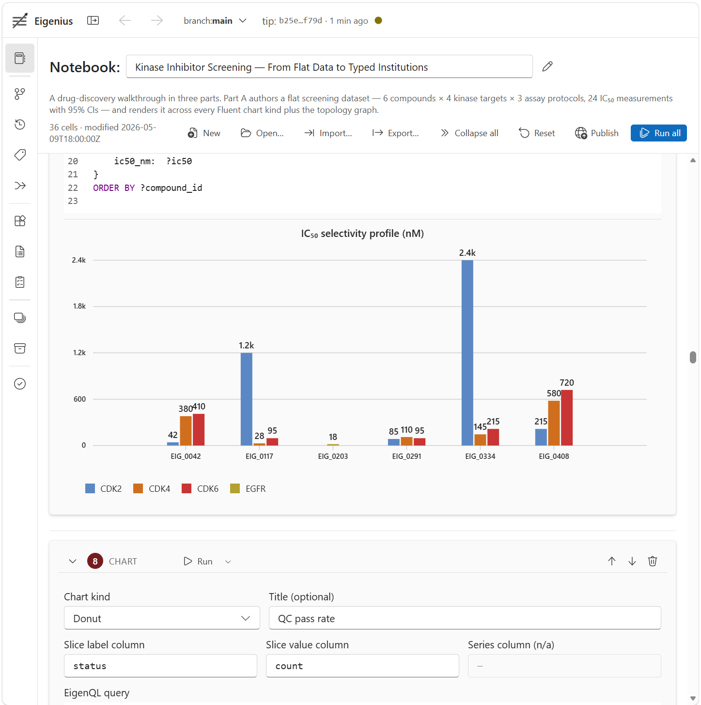

# 14. Notebook

The Eigenius notebook is the most accessible way to use the platform. It is a single-page React app served by the orchestrator at `/notebooks/`; cells run ESL, EigenQL, TypeScript, program invocations, and form-based charts against the live kernel via Connect-RPC; outputs auto-render as typed inspectors, result tables, layer-stack diagrams, program-trace trees, and Fluent charts.

If you have the docker stack up (`docker compose up -d`), you already have the notebook — it is bundled into the orchestrator image at build time and serves alongside the RPC endpoints. Open [http://localhost:8080/notebooks/](http://localhost:8080/notebooks/) in a browser.



This chapter is the operational reference for the notebook UX. Chain operations get their own chapters — see [chapter 15 — Tags, branches, and history](15-tags-branches-history.md) for the workspace panels that drive them and [chapter 16 — Merge resolution](16-merge-resolution.md) for the merge surface. The TypeScript SDK that powers the notebook (and that you can use programmatically from outside it) is documented in [chapter 17](17-typescript-sdk.md).

## 14.1. What's in a notebook

A notebook is an ordered sequence of typed cells. Six cell types are supported:

| Type | What it does | Run dispatch |
|---|---|---|
| `markdown` | Render-only prose (Github-flavoured Markdown). Click the eye/edit toggle to switch to source view. | None — it just renders. |
| `esl` | Eigenius Surface Language. Compiles + commits a layer on Run; output shows resource count + the new layer ID, with an expandable "View layer stack" accordion. | `eigen.load(source, "application/x-esl")` |
| `eigenql` | EigenQL query against the active layer chain. Output renders in a Fluent `DataGrid` with column types from the synthesized Property metadata. | `eigen.query(source)` |
| `typescript` | Sandboxed TS that runs in the browser with the SDK in scope. The cell's `return` value is auto-rendered (Resource → inspector, ResultSet → table, Topology → layer stack, plain object → JSON tree). | `new Function("eigen", "previousOutputs", source)` |
| `program-run` | Form-based program invocation: program IRI + one or more input IRIs. Single input renders as inspector + trace; multiple inputs render as a results table. | `eigen.runProgramByIri(programIri, inputIri)` per input |
| `chart` | Form-based chart: pick a chart kind (`grouped-bar` / `vertical-bar` / `horizontal-bar` / `donut` / `line` / `area`), write an EigenQL query, bind axis columns by `RETURN` short-name. Output is the corresponding Fluent `@fluentui/react-charts` component. | `eigen.query(query)` then pivot rows into the kind's data shape |

Cells are inserted via the hover-revealed `+` between any two cells (and above first / below last). Per-cell toolbar: type label · `Run` (when runnable) · `↑` / `↓` (move) · `🗑` (delete). Notebook-level toolbar (top): editable title · cell count · `Open…` (file picker) · `Save` (browser download) · `Reset` (clear outputs) · `Publish` (commit notebook to a layer; see §14.5) · `Run all` (top-to-bottom, halts on first error).

Source: [`notebooks/`](../../../notebooks/).

## 14.2. Running the notebook

### Production (docker stack)

```bash
docker compose up -d --build
# open http://localhost:8080/notebooks/
```

The orchestrator image ([`deploy/Dockerfile.orchestration`](../../../deploy/Dockerfile.orchestration)) is multi-stage: stage 1 builds the SPA with `vite build`; stage 2 is the Deno orchestrator runtime with `EIGENIUS_NOTEBOOK_STATIC=/app/notebooks` set so the notebook serves alongside the RPC paths on port 8080. Single origin, no CORS, no separate dev server.

The orchestrator drops the notebook route when `EIGENIUS_NOTEBOOK_STATIC` is unset — useful for headless deployments where the notebook isn't needed.

### Development (live HMR)

```bash
cd notebooks
npm install
npm run dev
# open http://localhost:5173/notebooks/
```

`vite dev` serves the SPA on port 5173 with hot-module reload. Connect-RPC traffic is proxied to the orchestrator on `localhost:8080` ([`vite.config.ts`](../../../notebooks/vite.config.ts)), so you still need a kernel + orchestrator running. The proxy paths are `/eigenius.v1.EigeniusKernel/*` and `/eigenius.v1.NotebookService/*`.

This is the path to use when iterating on the notebook itself.

## 14.3. Bundled example notebooks

Three example notebooks ship with the repository. The patent-analysis demo is what loads on first start; all three are importable via the **Imprt…** button.

### Patent-analysis demo

[`notebooks/examples/patent-analysis.json`](../../../notebooks/examples/patent-analysis.json). Six cells:

1. **markdown** — what the demo does
2. **esl** — the patent ontology (`PatentClaim`, `PatentAnalysis`, `PatentBrief`) plus the `analyze_patent` program
3. **eigenql** — `MATCH ?r {} WHERE ?r LIKE "urn:eigenius:demo:patent:%"` — list patent-namespace resources after the ESL load
4. **esl** — the transformer-patent input as a `resource patent:US10452978B2 : patent:PatentClaim { … }` declaration
5. **program-run** — invoke `urn:eigenius:demo:patent:analyze_patent` against `urn:eigenius:demo:patent:US10452978B2`
6. **typescript** — `return await eigen.layerTopology({ includeResources: false });` — auto-renders the layer stack

Click **Run all**. The first four cells finish in milliseconds; the program-run cell takes ~10–15 seconds (two LLM calls — `CompleteJson` extracts structured analysis, `CompleteText` writes the plain-language summary), then renders the typed `PatentBrief` output above an interactive trace tree (Program → Let analysis → ComponentTrace CompleteJson, Let summary → ComponentTrace CompleteText, with provider/model/token-count/latency on each component node).

Requires `ANTHROPIC_API_KEY` in the orchestrator's environment. Without it (`EIGENIUS_MOCK_LLM=true`), the LLM components return canned responses but the rest of the flow still works end-to-end.

### Kinase-institutions demo

[`notebooks/examples/kinase-institutions.json`](../../../notebooks/examples/kinase-institutions.json). The end-to-end showcase for the runtime substrate ([chapter 11](11-runtime-substrate.md)) — five Julia institutions installed, three cross-institution comorphisms registered, two storylines (Catalyst → DiffEq forward simulation; Symbolics → JuMP parameter fit). Setup script: [`notebooks/examples/kinase-institutions-setup.sh`](../../../notebooks/examples/kinase-institutions-setup.sh) (run once, ~30–60 minutes cold for the five Julia env builds; subsequent runs are fast due to the buildah cache).

Cells 13–18 exercise both surfaces of the comorphism chain-reinsertion contract (D14 §9.3):

- ESL `program` invocation as a qualified-name function call (`comorphisms:symbolics_to_jump(input)`) — output commits at a deterministic content-hash IRI.
- EigenQL `FIBER ... AS ?var INTO "<iri>"` — output commits at a caller-named IRI.

See [chapter 8 §8.4](08-demos.md#84-kinase-institutions--multi-institution-julia-stack) for the storyline overview and the per-institution walkthroughs under [`platform/julia-institutions/`](julia-institutions/) for one-at-a-time slow-walks.

### Lean-verification demo

[`notebooks/examples/lean-verification.json`](../../../notebooks/examples/lean-verification.json). The showcase for the platform's first verification institution. Walks the closed audit chain D28 §5.7 promises — verdict → proof term → mirror anchor → mirrored class — for a real Lean 4 proof of `∀ p : EigeniusFFI.Patient, p.weight ≥ 0 → p.weight + 10 ≥ 10`. Setup script: [`notebooks/examples/lean-verification-setup.sh`](../../../notebooks/examples/lean-verification-setup.sh) (fast — the Lean institution runs in-process so no Docker / Lake / env-image build is needed at notebook-load time).

Ten cells alternating markdown (audit-chain narrative) and EigenQL (one query per step backward through the chain). The first EigenQL cell finds the `Verdict::Holds` resource AutoOnLoad produced; subsequent cells trace the cross-references back to the chain-side Patient class declaration.

See [chapter 8 §8.5](08-demos.md#85-lean-verification--lean-4-verification-audit-chain) for the storyline overview and [`platform/lean-institution/`](lean-institution/) for the in-process verification-side slow-walk.

### Markdown maths

Markdown cells render `$inline$` and `$$display$$` LaTeX via [remark-math](https://github.com/remarkjs/remark-math) + [rehype-katex](https://github.com/remarkjs/remark-math/tree/main/packages/rehype-katex). The kinase notebook uses this extensively to render the Michaelis–Menten / competitive-inhibition equations alongside the FormulaTerm encodings of the same expressions, so the surface and the chain payload align visually.

## 14.4. The notebook file format

Notebooks are versioned JSON with a discriminated cell-type union. Schema in [`notebooks/src/persistence/notebook-format.ts`](../../../notebooks/src/persistence/notebook-format.ts):

```typescript
{
  format_version: 1,
  meta: {
    title?, description?, created?, modified?, eigenius_version?
  },
  cells: [
    // Source-bearing cell:
    { id: "<uuid>", type: "markdown" | "esl" | "eigenql" | "typescript", source: "..." },
    // Program-run cell:
    { id: "<uuid>", type: "program-run", program_iri: "...", input_iris: ["...", ...] },
    // Chart cell:
    { id: "<uuid>", type: "chart", query: "...",
      chart_kind: "grouped-bar" | "vertical-bar" | "horizontal-bar" | "donut" | "line" | "area",
      x_column: "...", y_column: "...",
      series_column?: "...", title?: "..." }
  ]
}
```

`Save` from the toolbar serialises the current store state to this JSON (with `meta.modified` updated to the save time) and triggers a browser download. `Open…` reads a file via `<input type="file">`, validates the shape, and replaces the store contents. Cell outputs are NOT persisted — they're re-derived by re-running the cells.

## 14.5. Publish to layer

Beyond the on-disk file, a notebook can be published as resources in the kernel's knowledge graph. Click **Publish** in the toolbar; the SDK translates the notebook into a `notebook:Notebook` resource referencing one `notebook:Cell` resource per cell, then loads them into a new layer. The accompanying ontology — [`ontologies/notebook/notebook-ontology.json`](../../../ontologies/notebook/notebook-ontology.json) — is part of the kernel's boot chain (5th layer, after core / program / reflection / institution), so publish succeeds without first registering anything.

IRIs are content-addressed:

- **Cell IRI** = `urn:eigenius:notebook:cell:<sha256>` over the cell's structural form: `{cell_type, source}` for source-bearing cells, `{cell_type, program_iri, input_iris}` for program-run cells, `{cell_type, query, chart_kind, x_column, y_column, series_column, title}` for chart cells
- **Notebook IRI** = `urn:eigenius:notebook:<sha256>` over `{format_version, title, description, cells:[<cellIri>...]}`. Excluded from the hash on purpose: timestamps and `eigenius_version`, so re-saving identical content yields the same Notebook IRI.

Identical cells across notebooks share a single `Cell` resource — useful for tracking "find every notebook that contains this exact ESL load" and similar queries. The ontology supports queries like `MATCH ?n FROM Notebook WHERE ?n.title LIKE "%patent%"` or `MATCH ?c FROM Cell WHERE ?c.source LIKE "%CompleteJson%"`.

Translator source: [`clients/eigenius-ts/src/notebook.ts`](../../../clients/eigenius-ts/src/notebook.ts).

## 14.6. Auto-rendering of cell outputs

The notebook has type-driven renderers under [`notebooks/src/components/output/`](../../../notebooks/src/components/output/):

- `ResultTable` — Fluent v9 `DataGrid` for `QueryResponse.document` (Eigon-CBOR ResultSet decoding)
- `ResourceInspector` — `@id` + `is_a` tags + sorted property table for any CBOR-encoded resource
- `LayerStackView` — vertical stack of layer boxes (head at top, root at bottom) with per-kind counts, walks `PARENT_LAYER` edges to recover the chain
- `TraceTree` — collapsible tree for `ProgramTrace` resources; flattens right-leaning let-chains into siblings so the visual hierarchy matches dataflow order; surfaces input hashes, provider/model, and per-component latency
- `TypeScriptValueView` — duck-typed dispatcher for TS-cell return values (Resource / ResultSet / RunProgramResponse / LoadResponse / Topology / DOM node / object / primitive). Also the mount point for chart-cell output: `executeChartCell` returns a Fluent chart React element, which `TypeScriptValueView` recognises via `isValidElement` and renders directly.

The ESL-cell load output also has a "View layer stack" accordion that lazy-fetches the topology when expanded and renders it in `LayerStackView`.

Chart cells handle one Fluent quirk worth knowing about: `LineChart` and `AreaChart` only support numeric or `Date` x-axes natively. When the EigenQL query returns categorical x values (target names, compound IDs, …), `renderChart` maps each unique label to an integer index in encounter order — so the EigenQL `ORDER BY` controls layout — and labels each tick via the chart's `xAxis.tickText` array. Per-point `xAxisCalloutData` carries the original label into hover callouts. ISO date strings (`YYYY-MM-DD`) are detected separately and converted to `Date` objects so date-axis charts render correctly without a categorical index.

## 14.7. Where it lives

```
notebooks/
├── src/
│   ├── App.tsx                  # FluentProvider + EigenProvider + Notebook
│   ├── components/
│   │   ├── Notebook.tsx          # Toolbar + cell list
│   │   ├── Cell.tsx              # Per-cell shell (toolbar + body + output)
│   │   ├── CellInsertGap.tsx     # Hover-revealed "+" between cells
│   │   ├── cells/                # MarkdownCell, ProgramRunCell, ChartCell form editors
│   │   ├── editors/              # CodeMirror wrapper + ESL/EigenQL language modes
│   │   └── output/               # The renderers listed in §14.6
│   ├── persistence/notebook-format.ts   # NotebookJson + parseNotebook validator
│   └── runtime/
│       ├── EigenProvider.tsx     # React context for the SDK client
│       ├── notebookStore.ts      # Zustand: cells, meta, run state, run actions
│       ├── resultDocument.ts     # Eigon-CBOR ResultSet decoder
│       └── traceResource.ts      # ProgramTrace decoder
├── examples/
│   ├── patent-analysis.json            # Seeded on first load
│   ├── kinase-institutions.json        # Three-part walkthrough: flat data → institutions → chain reinsertion
│   └── kinase-institutions-setup.sh    # Installs five Julia institutions + three comorphisms
├── e2e/
│   ├── patent-demo.spec.ts             # Playwright golden flow
│   └── kinase-charts.spec.ts           # Chart-cell coverage (Part A of the kinase-institutions notebook)
├── playwright.config.ts
├── vite.config.ts                # /notebooks/ base + Connect-RPC proxy in dev
└── package.json                  # @eigenius/client + Fluent UI v9 + CodeMirror
```

The SDK consumed by the notebook is a `file:` workspace dep on [`clients/eigenius-ts/`](../../../clients/eigenius-ts/) — see [chapter 17](17-typescript-sdk.md).

## 14.8. CI

Two Playwright specs cover the notebook end-to-end:

- [`notebooks/e2e/patent-demo.spec.ts`](../../../notebooks/e2e/patent-demo.spec.ts) — the LLM-free critical path: open `/notebooks/`, assert the cells render, click `Run all`, assert both ESL load outputs appear, assert the EigenQL grid shows patent-namespace IRIs.
- [`notebooks/e2e/kinase-charts.spec.ts`](../../../notebooks/e2e/kinase-charts.spec.ts) — chart-cell regression coverage: opens the consolidated kinase-institutions demo via the `Open…` file picker, runs Part A's cells (1–13) individually, asserts that `.fui-cart__root` × 4 (cartesian charts), `.fui-hbc__root` × 1 (horizontal-bar), and `.fui-donut__root` × 1 are mounted, and that no Part-A cell surfaced a `Cell failed` MessageBar. Parts B/C are skipped because they require the Julia institutions setup, which CI does not run. This catches regressions in the categorical-x → numeric-index → tickText mapping that line/area charts depend on.

Both are wired up in [`.github/workflows/notebooks-tests.yml`](../../../.github/workflows/notebooks-tests.yml) — brings the docker stack up with `EIGENIUS_MOCK_LLM=true`, runs Playwright, uploads the report on failure.

Run locally:

```bash
cd notebooks
npx playwright install chromium  # one-time
npm run test:e2e
```

The test assumes the orchestrator stack is already up at `http://localhost:8080`.

## 14.9. Design references

- [**D22** — Notebook UX and TypeScript SDK](../../design/d22-notebook-and-typescript-sdk.md) — the spec this guide describes
- [**chapter 15** — Tags, branches, and history](15-tags-branches-history.md) — the workspace panels that drive named refs + chain navigation
- [**chapter 16** — Merge resolution](16-merge-resolution.md) — picking a per-conflict strategy, the cascade gate, and the resolution flow
- [**chapter 17** — TypeScript SDK](17-typescript-sdk.md) — the programmatic API the notebook is built on, also usable from your own code

---

Next: **[15. Tags, branches, and history →](15-tags-branches-history.md)**
