# WRN PoC — epistemic dependency graph

From literature references + datasets through to the final synthetic-lethal
conclusion. **Node colour encodes the four epistemic statuses**, using the
official site warrant palette ([website/src/styles/custom.css](../../../../website/src/styles/custom.css)):

- 🟦 **Observed** `#3A7CA5` — recorded from reality (datasets, `PinnedExternalFile`s, `SampleSet`s, the xenograft table).
- 🟧 **Derived** `#D98C5F` — computed with an `IsDerivedAs` witness (statistics-institution results, wrapped-R results, linked-external `ToolArtifact`s).
- 🟪 **Declared** `#8B5CB0` — asserted on authority (inference rules, statistical→domain bridges, impossibility witnesses, **literature warrants** = `reference:Citation`).
- 🟩 **Verified** `#2E9D5D` — kernel-checked reasoning conclusions (`ReasoningSentence` that Holds); the bold-green apex is the final claim (itself a verified conclusion).

Edge style: **solid** = logical premise (composed into a certificate); **dotted**
= method/source provenance (CiTO `uses_method_in` / `cites_as_source_document`)
for literature warrants authored but not yet logically composed.

```mermaid
flowchart LR
  classDef observed fill:#3A7CA51A,stroke:#3A7CA5,color:#14181F;
  classDef derived  fill:#D98C5F1A,stroke:#D98C5F,color:#14181F;
  classDef declared fill:#8B5CB01A,stroke:#8B5CB0,color:#14181F;
  classDef verified fill:#2E9D5D1A,stroke:#2E9D5D,color:#14181F;
  classDef final    fill:#2E9D5D33,stroke:#2E9D5D,color:#052E16,stroke-width:3px;

  subgraph KEY["Epistemic status (node colour)"]
    direction LR
    k1[Observed]:::observed
    k2[Derived]:::derived
    k3[Declared]:::declared
    k4[Verified]:::verified
    k5[Final claim]:::final
  end

  %% ============ DATASETS (observed) ============
  subgraph DATA["Datasets / source data (Observed)"]
    direction TB
    supp["Supp Table 1<br/>MSI · WRN-dep · mutator load"]:::observed
    ach["Achilles CERES matrix (187 MB)"]:::observed
    drive["DRIVE DEMETER2 matrix"]:::observed
    rds["DepMap 18Q4 omics .rds (1.6 GB)"]:::observed
    rnaseq["GSE126464 WRN-KO RNA-seq"]:::observed
    gmt["MSigDB Hallmark .gmt"]:::observed
    fig2["Fig 2 source<br/>(rescue, xenograft)"]:::observed
    ed3["ED Fig 3b competition"]:::observed
    ed4["ED Fig 4b/c/d<br/>cell-cycle / apoptosis"]:::observed
    ed5["ED Fig 5 p-p53 / p21 IF"]:::observed
    ed6["ED Fig 6 γH2AX + 53BP1<br/>(intensity 6c, foci 6a/d/f/h)"]:::observed
    ed7["ED Fig 7b/d pATM(S1981) foci"]:::observed
    ed8["ED Fig 8d coloc · FISH"]:::observed
    ed10["ED Fig 10 MMR restoration / HCR"]:::observed
  end

  %% ============ LITERATURE (declared warrants) ============
  subgraph LIT["Literature warrants — reference:Citation (Declared)"]
    direction TB
    L1["[1] Chan&amp;Giaccia<br/>synthetic lethality"]:::declared
    L14["[14] Swanson<br/>WRN exo/helicase separable"]:::declared
    L16["[16] Buehler<br/>C911 control valid"]:::declared
    L17["[17] Loughery<br/>p53-S15 = p53 activation"]:::declared
    L20["[20] Bendtsen<br/>WRN nucleolar dynamics"]:::declared
    L22["[22] Haugen — MSH3 loss"]:::declared
    L10["[10] Meyers — CERES"]:::declared
    L11["[11] McDonald — DRIVE"]:::declared
    L36["[36] Ritchie — limma"]:::declared
    L40["[40] Law — voom"]:::declared
    L43["[43] Liberzon — Hallmark"]:::declared
  end

  %% ============ COMPUTATIONAL DISCOVERY (Phase 1) ============
  subgraph DISC["Computational discovery (Phase 1)"]
    direction TB
    r_dep["wrn_dep result<br/>Wilcoxon, mean_diff&lt;0"]:::derived
    c_sel["SelectivelyEssential(WRN,MSI)"]:::verified
    r_corr["wrn_corr result (Spearman)"]:::derived
    c_refine["DependencyCorrelatesWithMutatorLoad"]:::verified
    r_recq["wrn_recq result"]:::derived
    c_recq["OnlyMSISelectiveInFamily(WRN,RecQ)"]:::verified
    r_biom["biomarker result (PPV/sens)"]:::derived
    c_biom["StrongBiomarker(MSI,WRN)"]:::verified
    r_lineage["mutator_load result (Wilcoxon P=1.7e-9)"]:::derived
    c_lineage["ElevatedMutatorLoadInCommonLineages"]:::verified
    r_p53m["p53_dep result"]:::derived
    c_p53m["ModulatesDependence(TP53,WRN)"]:::verified
    r_ddach["dd_achilles result<br/>TopDiffDep Q=4.8e-24"]:::derived
    r_dddrive["dd_drive result Q=1.5e-45"]:::derived
    r_ddgdsc["dd_gdsc result (PCR-MSI)"]:::derived
    r_paralog["paralog_ctrl result"]:::derived
    c_paralog["NotExplainedByParalogLoss"]:::verified
  end

  %% ============ VALIDATION ARMS ============
  subgraph VAL["Wet-lab + in-vivo validation"]
    direction TB
    r_viab["viab results KM12/OVK18<br/>(nested ANOVA)"]:::derived
    c_val["SelectiveViabilityDependence(WRN,MSI)"]:::verified
    xeno["xenograft volume table"]:::observed
    r_vivo["vivo_lme4 result<br/>(lme4 LRT, p≈0.048)"]:::derived
    c_vivo["InVivoDependence(WRN,MSI)"]:::verified
    seedctl["vivo_seed_control (C911)"]:::derived
    rule_seed["seed_control_rule"]:::declared
    c_vivo_ot["OnTarget(WRN,xenograft)"]:::verified
    r_rescue["rescue results WT / E84A<br/>(t-test)"]:::derived
    rule_ont["ontarget_rule"]:::declared
    c_ont["OnTarget(WRN,MSI_viability)"]:::verified
    k577m["va_fail_k577m (non-rescue)"]:::derived
    rule_hel["helicase_rule"]:::declared
    rule_exo["exo_rule"]:::declared
    c_hel["RequiresActivity(WRN,helicase)"]:::verified
    c_exo["DispensableActivity(WRN,exonuclease)"]:::verified
  end

  %% ============ MECHANISM (C-MECH) ============
  subgraph MECH["Mechanism: DSB → DDR → lethality"]
    direction TB
    mech_dsb["mech_dsb (DSB-marker IF)"]:::derived
    r_foci["foci_dsb result<br/>53BP1 ×MSI interaction"]:::derived
    c_dsb["CausesDSBs(WRN,MSI)"]:::verified
    c_dsb_foci["CausesDSBs — 53BP1 (reproduced)"]:::verified
    r_gh2ax["gh2ax result<br/>γH2AX intensity emmeans"]:::derived
    c_dsb_gh2ax["CausesDSBs — γH2AX intensity (reproduced)"]:::verified
    r_gh2axf["gh2ax_foci result<br/>γH2AX foci ×MSI lm"]:::derived
    c_dsb_gh2axf["CausesDSBs — γH2AX foci (reproduced)"]:::verified
    r_patm["patm result<br/>pATM(S1981) foci ×MSI lm"]:::derived
    c_ddr["ActivatesDSBResponse(WRN,MSI)"]:::verified
    r_cc["cell-cycle results (ANOVA)"]:::derived
    c_cc["CausesCellCycleArrest(WRN,MSI)"]:::verified
    r_apop["apoptosis results (ANOVA)"]:::derived
    c_apop["CausesApoptosis(WRN,MSI)"]:::verified
    r_apopsh["apop_shrna result (KM12)"]:::derived
    c_apopsh["CausesApoptosis — shRNA"]:::verified
    r_gsea["gsea_mech result<br/>(limma-voom→fgsea)"]:::derived
    r_ifed5["if_ed5 result (emmeans)<br/>RaisesP53DamageMarkers"]:::derived
    rule_p53["p53_activation_rule"]:::declared
    c_p53a["ActivatesP53Response(WRN,MSI)"]:::verified
    r_coloc["coloc result (t-test)"]:::derived
    c_coloc["ReducedNucleolarColocalization"]:::verified
    fish["fish_readout"]:::derived
    c_nottel["NotViaTelomereDefect(WRN,MSI)"]:::verified
    rule_mech["mech_rule"]:::declared
    c_mech["DSBDrivenLethality(WRN,MSI)"]:::verified
  end

  %% ============ MMR contribution ============
  subgraph MMRG["MMR deficiency contributes"]
    direction TB
    r_mmr["mmr_restoration results (crossed ANOVA)"]:::derived
    c_mmrr["RestorationPartiallyRescues(dMMR,WRN)"]:::verified
    r_hcr["hcr result (host-cell reactivation)"]:::derived
    c_hcr["MMRRestorationRestoresRepair"]:::verified
    rule_mmr["mmr_rule"]:::declared
    c_mmr["ContributesToDependence(dMMR,WRN)"]:::verified
  end

  rule_main["synthesis_rule (synthetic-lethality thesis)"]:::declared
  MAIN["concl_main<br/>SyntheticLethal(WRN, MSI)"]:::final
  disc_out["discovery_finding<br/>Phase-1 TaskOutput (deliverable)"]:::derived

  %% ---------- discovery edges ----------
  supp --> r_dep --> c_sel
  supp --> r_corr --> c_refine
  ach --> r_recq --> c_recq
  supp --> r_biom --> c_biom
  supp --> r_lineage --> c_lineage
  supp --> r_p53m --> c_p53m
  ach --> r_ddach
  drive --> r_dddrive
  ach --> r_ddgdsc
  supp --> r_ddach
  supp --> r_dddrive
  supp --> r_ddgdsc
  rds --> r_paralog --> c_paralog
  supp --> r_paralog
  L10 -.->|method| r_ddach
  L36 -.->|method| r_ddach
  L36 -.->|method| r_dddrive
  L11 -.->|source| r_dddrive
  r_ddach -.->|top MSI dependency| c_sel

  %% ---------- Phase-1 deliverable (second apex) ----------
  c_sel --> disc_out
  c_recq --> disc_out
  c_biom --> disc_out
  c_refine --> disc_out
  c_lineage --> disc_out
  c_p53m --> disc_out

  %% ---------- validation edges ----------
  ed3 --> r_viab --> c_val
  fig2 --> xeno --> r_vivo --> c_vivo
  fig2 --> seedctl
  L16 ==>|premise| rule_seed
  seedctl --> rule_seed --> c_vivo_ot
  fig2 --> r_rescue
  r_rescue --> rule_ont --> c_ont
  fig2 --> k577m
  L14 ==>|premise| rule_hel
  L14 ==>|premise| rule_exo
  k577m --> rule_hel --> c_hel
  r_rescue --> rule_exo --> c_exo

  %% ---------- mechanism edges ----------
  ed6 --> r_foci --> c_dsb_foci
  ed6 --> r_gh2ax --> c_dsb_gh2ax
  ed6 --> r_gh2axf --> c_dsb_gh2axf
  ed7 --> r_patm --> c_ddr
  supp --> r_gh2ax
  supp --> r_gh2axf
  supp --> r_patm
  mech_dsb --> c_dsb
  ed4 --> r_cc --> c_cc
  ed4 --> r_apop --> c_apop
  ed4 --> r_apopsh --> c_apopsh
  rnaseq --> r_gsea
  gmt --> r_gsea
  L40 -.->|method| r_gsea
  L43 -.->|source| r_gsea
  ed5 --> r_ifed5
  L17 ==>|premise| rule_p53
  r_ifed5 --> rule_p53 --> c_p53a
  ed8 --> r_coloc --> c_coloc
  L20 -.->|authority| c_coloc
  ed8 --> fish --> c_nottel
  r_gsea -.->|transcriptional| c_cc
  rule_mech --> c_mech
  c_dsb --> c_mech
  c_cc --> c_mech
  c_apop --> c_mech

  %% ---------- MMR edges ----------
  ed10 --> r_mmr --> c_mmrr
  ed10 --> r_hcr --> c_hcr
  L22 -.->|background| c_hcr
  rule_mmr --> c_mmr
  c_mmrr --> c_mmr

  %% ---------- apex ----------
  L1 -.->|background| rule_main
  rule_main --> MAIN
  c_val --> MAIN
  c_vivo --> MAIN
  c_hel --> MAIN
  c_mech --> MAIN
  c_mmr --> MAIN
  c_paralog --> MAIN
  c_sel -.->|establishes| MAIN
```



**Two apex deliverables.** The encoding has *two* convergence points, not one:
- `concl_main` (`SyntheticLethal(WRN, MSI)`) — composed by `synthesis_rule` over
  **six** verified antecedents: selective viability dependence (C-VAL), in-vivo
  dependence (C-VIVO), helicase-activity requirement (D-HELICASE), the
  DSB-driven-lethality mechanism (C-MECH), the MMR contribution (C-MMR), and the
  specificity control that the dependence is intrinsic to MSI, not a paralogue
  co-loss confound (`NotExplainedByParalogLoss`, ED 9a).
- `discovery_finding` — the Phase-1 computational-discovery `bench:TaskOutput`,
  citing **six** discovery conclusions: `SelectivelyEssential`,
  `OnlyMSISelectiveInFamily` (RecQ), `StrongBiomarker`,
  `DependencyCorrelatesWithMutatorLoad`, `ElevatedMutatorLoadInCommonLineages`
  (ED 2b, biomarker lineage-restriction), and `ModulatesDependence(TP53,WRN)`
  (the p53-independence characterization).

Every kernel-verified conclusion now has a consumer — there are no terminal
characterizations left dangling (each Phase-1 characterization feeds
`discovery_finding`; the omics-computed paralogue-specificity control, which
loads after Phase 1, feeds `concl_main`).

**Where the logical literature composition lives** (heavy `==>` edges): Swanson
[14] → `helicase_rule`/`exo_rule`; Buehler [16] → `seed_control_rule`; Loughery
[17] → `p53_activation_rule` (the IF warrant emits the measured
`RaisesP53DamageMarkers`, lifted to `ActivatesP53Response` by [17]). The other
warrants ([1], [10], [11], [20], [22], [36], [40], [43]) are *correctly*
provenance (dotted): method (`uses_method_in`), source (`cites_as_source_document`),
or background (`obtains_background_from`) — not logical premises of a domain claim.

---

## Collapsed view (one box per claim thread) — for slides

Same epistemic-status colours; each box is a whole thread. Datasets (Observed)
and literature warrants (Declared) on the left feed the verified claim threads,
which compose into the final synthetic-lethal conclusion.

```mermaid
flowchart LR
  classDef observed fill:#3A7CA51A,stroke:#3A7CA5,color:#14181F;
  classDef derived  fill:#D98C5F1A,stroke:#D98C5F,color:#14181F;
  classDef declared fill:#8B5CB01A,stroke:#8B5CB0,color:#14181F;
  classDef verified fill:#2E9D5D1A,stroke:#2E9D5D,color:#14181F;
  classDef final    fill:#2E9D5D33,stroke:#2E9D5D,color:#052E16,stroke-width:3px;

  DATA["📊 Datasets<br/>DepMap (Achilles/DRIVE/rds), Supp Table 1,<br/>RNA-seq + Hallmark, Nature Source Data"]:::observed
  LIT["📚 Literature warrants<br/>18 CiTO-typed Citations (11 claim warrants)"]:::declared

  DISC["Computational discovery<br/>SelectivelyEssential · TopDiffDep ·<br/>biomarker · RecQ-unique · mutator-load"]:::verified
  VAL["C-VAL viability<br/>SelectiveViabilityDependence"]:::verified
  VIVO["C-VIVO in vivo + on-target<br/>InVivoDependence"]:::verified
  HEL["D-HELICASE<br/>RequiresActivity(helicase) ⟸ [14]"]:::verified
  MECH["C-MECH mechanism<br/>DSBs → arrest + apoptosis →<br/>DSBDrivenLethality"]:::verified
  MMR["C-MMR<br/>ContributesToDependence(dMMR)"]:::verified
  SPEC["Specificity control (ED 9a)<br/>NotExplainedByParalogLoss"]:::verified

  MAIN["SyntheticLethal(WRN, MSI)"]:::final

  DATA --> DISC
  DATA --> VAL
  DATA --> VIVO
  DATA --> HEL
  DATA --> MECH
  DATA --> MMR
  DATA --> SPEC
  LIT  -.->|method / source / background| DISC
  LIT  ==>|premise [14]| HEL
  LIT  ==>|premise [16]| VIVO
  LIT  ==>|premise [17]| MECH
  LIT  -.->|authority [20]| MECH
  LIT  -.->|background [22]| MMR

  DISC -.->|establishes| MAIN
  VAL  --> MAIN
  VIVO --> MAIN
  HEL  --> MAIN
  MECH --> MAIN
  MMR  --> MAIN
  SPEC --> MAIN
```
