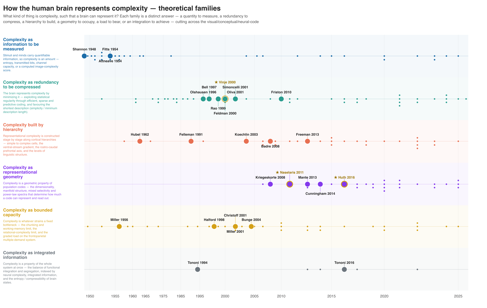
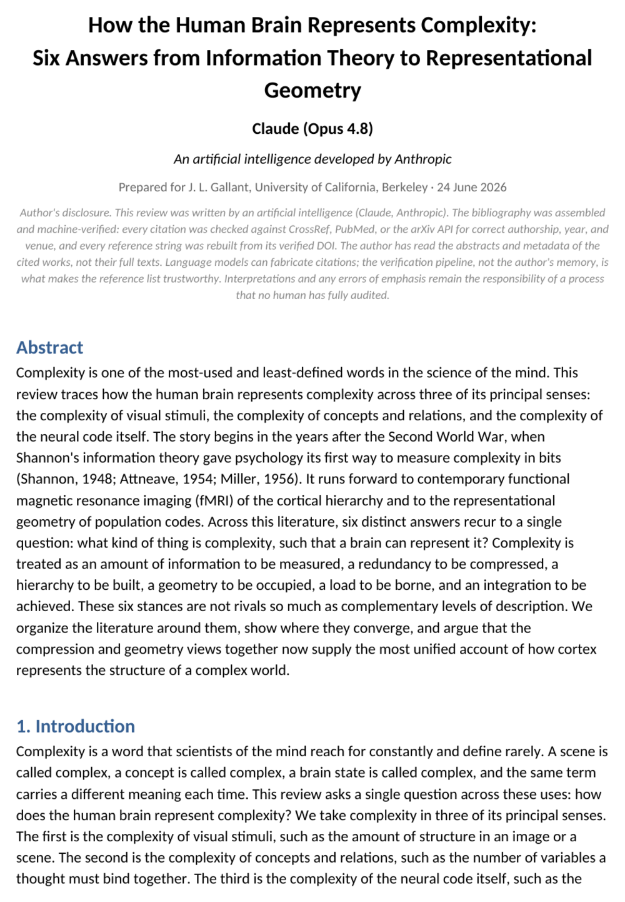
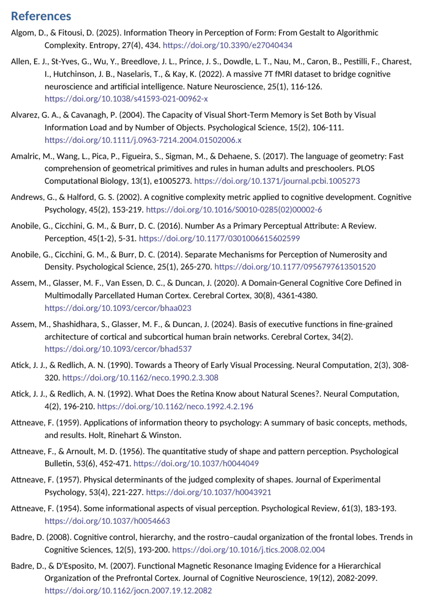

# Phases in detail

Every phase below lists **what it does**, **the command**, and — where it
produces something — **the real output as a figure**. Commands assume you're
inside a topic subdirectory with the toolkit at `../tools/`. The full procedure
lives in
[`PLAYBOOK.md`](https://github.com/gallantlab/literature-review-toolkit/blob/main/PLAYBOOK.md).

!!! tip "Lab mode"
    Lab mode replaces Phases 1–2 with its own corpus-ingest front end (L1–L3) and
    then runs Phases 3–8 verbatim. See [Topic mode vs lab mode](modes.md).

---

## Phase 1 — Scope the topic

**Human decision.** You and the agent agree on the question and its span — field,
species/method restrictions, how far back to go. The agreement is written to
`topic_definition.md` so later phases (and the antecedents search) stay anchored.

---

## Phase 2 — Search

The agent (or you) runs a literature-search pass using
[`tools/search_prompt_template.md`](https://github.com/gallantlab/literature-review-toolkit/blob/main/tools/search_prompt_template.md),
returning papers as `rows.json`. **Links must be DOI URLs.** This is the
recency-biased forward search — it finds the current literature but misses the
roots, which is what Phase 2b is for.

---

## Phase 2b — Antecedents *(required)*

!!! abstract "The roots the forward search misses"
    Every review — topic **and** lab mode — must include an antecedents pass. The
    forward search is anchored on the topic's *current* framing; the antecedents
    pass deliberately reaches back along three axes:

    1. **Measurement / methodology origins** — where the tools came from.
    2. **Foundational empirical results** — older neurophysiology, psychophysics, etc.
    3. **Theory / computational framework** — the ideas the field is built on.

Reuse the search template with the tier flipped to favour classic/foundational
work, then fold the results into the existing themes (no new lanes unless you ask
for them). Pre-2000 classics, books, and chapters often have **no DOI** — they're
kept as hand-written canonical APA and excluded from citation counting.

---

## Phase 3 — Verify EVERY citation *(critical)*

```bash
python3 ../tools/verify.py --citations rows.json --out verify_report.json
```

!!! danger "This is the step that earns the toolkit's trust"
    Search agents fabricate roughly **1 in 4** citations. `verify.py` checks every
    one against PubMed/PMC/CrossRef and the **arXiv API** (so preprints and
    conference papers get a real verdict, not a misleading `NOT-FOUND`). It catches:

    - wrong / fabricated first authors,
    - invented or mis-copied DOIs (including DOIs that resolve to a *real but
      unrelated* paper),
    - inverted or misattributed findings,
    - entirely fabricated author lists for papers that genuinely exist.

The report marks each citation `OK` / `MISMATCH` / `NOT-FOUND` / `ERROR` so you
(or the agent) can fix or drop it before anything downstream depends on it.
`NOT-FOUND` and `ERROR` are **not** interchangeable: `NOT-FOUND` means every
lookup completed and nothing matched (chase it — likely fabricated), while
`ERROR` means a lookup could not complete (rate-limit / network) and must be
**re-run**. To keep arXiv's aggressive rate-limiting from turning real preprints
into false `NOT-FOUND`s, arXiv ids are prefetched in batches (`id_list`, many per
call). `expect_year` may be a string or an int.

---

## Phase 3f — Canonicalize EVERY reference *(hard gate)*

```bash
python3 ../tools/references.py --rows rows.json --out rows.json
python3 ../tools/references.py --rows rows.json --audit   # exits non-zero on any defect
```

Rebuilds every reference from its **verified** DOI/arXiv id into canonical APA-7:
full author lists, nobiliary particles, sentence-case titles, real venue names
(including bioRxiv/PsyArXiv), HTML-unescaping. The journal DOI is preferred over
an arXiv preprint as the version of record. No agent-typed or database-typed
reference string is trusted — it's all regenerated from the resolved record.

!!! success "The audit is a build gate"
    `--audit` exits **non-zero** on any imperfect reference (empty venue, missing
    year, etc.). A broken reference fails the pipeline, not your reader. Only a
    genuinely DOI-less book/report may keep a hand-written APA string.

After this phase, **`rows.json` is the live table** — edit it directly for later
changes; re-running an upstream emitter is destructive.

---

## Phase 4 — Download PDFs *(opt-in)*

Off by default — the `PDF (local)` column stays empty unless you ask. When
enabled, [`tools/download.py`](https://github.com/gallantlab/literature-review-toolkit/blob/main/tools/download.py)
fetches from arXiv → Unpaywall → EuropePMC, and
[`tools/reconcile_downloads.py`](https://github.com/gallantlab/literature-review-toolkit/blob/main/tools/reconcile_downloads.py)
files manually-downloaded PDFs into the topic directory.

---

## Phase 5 — Build the spreadsheet

```bash
python3 ../tools/spreadsheet.py --rows rows.json --out my_topic_bibliography.xlsx
```

The core deliverable. Columns:
`Topic · Ref# · APA reference · Link · Summary · Tag · Family · Cite (OpenAlex) ·
Cite (S2) · PDF (local) · Xref`. Rows are **colour-coded by origin**, and the
`Cite` / `Family` columns appear automatically once their passes have run.

<p>
<span class="swatch source"></span> cited in your source doc (if any) &nbsp;·&nbsp;
<span class="swatch search"></span> agent forward/antecedents search &nbsp;·&nbsp;
<span class="swatch xref"></span> cross-citation pass
</p>

A live slice of a real bibliography (`complexity_representation`, 190 rows):

<div markdown>
--8<-- "docs/_includes/bib_table.html"
</div>

<small>The `Link` column (not shown above) is always the DOI URL
(`https://doi.org/<doi>`).</small>

---

## Phase 5b — Citation counts

```bash
python3 ../tools/citations.py --rows rows.json --out citation_counts.json
# then re-run spreadsheet.py to add the Cite columns
```

Per-paper counts from **OpenAlex** (primary) reconciled against **Semantic
Scholar** by DOI. (Google Scholar has no API and blocks bots, so it isn't
usable.) The tool guards against OpenAlex's known batch-undercount — it keeps the
max per DOI and re-queries the canonical single-work endpoint when OpenAlex looks
implausibly low next to S2. No-DOI items stay blank. Set `S2_API_KEY` to avoid
429s on large corpora.

!!! warning "A published DOI is not automatically the version of record"
    Before promoting a preprint row to a journal/proceedings DOI, query the
    candidate DOI's OpenAlex count. Curran/Proceedings.com DOIs for the printed
    NeurIPS volumes (`10.52202/*`) resolve and show up in a CrossRef title
    search, but they are shadow records — swapping to them cut counts ~3-4× on a
    real corpus while adding nothing. ACL Anthology (`10.18653/*`), IEEE/CVF
    (`10.1109/*`) and true journal DOIs are genuine upgrades. If the candidate's
    count is much lower than the arXiv record's, keep arXiv.

---

## Phase 6 — Cross-citation pass

```bash
python3 ../tools/xref.py --papers verified.json --exclude existing_dois.json \
                         --out xref_my_topic.json --min-cites 4 --resolve-unknown
```

Mines the corpus's own reference lists (via CrossRef) into a frequency table:
which papers does *your* corpus cite most? Frequently-cited papers you missed are
strong candidates to add. Pick the high-value ones, append them to `rows.json`,
and **send the batch back through Phases 3 + 3f + 5** (re-verify, re-canon).

!!! warning "Ids must stay unique across merges"
    Reference ids must be globally unique after a merge, and citation counts are
    attached **only after ids are final** — otherwise counts silently
    cross-contaminate. Assert `len(refs) == len(set(refs))` after merging.

---

## Phase 6b — Families + lineage figure *(optional)*

```bash
# agent proposes a grouping; you approve/edit the definitions, then:
python3 ../tools/families.py --rows rows.json --assign families_input.json --out families.json
python3 ../tools/families_figure.py --rows rows.json --families families.json \
        --out-prefix my_topic_families --title "My topic — families"
```

**Human decision #2.** The agent proposes a small set of theoretical families;
you approve or edit the *definitions* before it labels every paper. Then
`families_figure.py` renders an **interactive HTML** lineage figure (plus
SVG/PNG/PDF): families as horizontal lanes on a citation-weighted timeline, with
**landmark dots auto-selected** by citation count, within-corpus citation
in-degree, and lab authorship — no hand-built label map.

!!! note "Home-lab favouring is off by default"
    The lab-authorship criterion — starring your own group's papers as
    landmarks — is **disabled** unless you opt in, so the toolkit is neutral for
    anyone who clones it. Enable it per project with `--lab-author Surname`
    (repeatable), or once for your shell with `export LITREVIEW_LAB_AUTHOR=Surname`
    (comma-separated for several surnames); the flag overrides the env var.

<figure class="fig" markdown>
{ loading=lazy }
<figcaption>
`complexity_representation` — six families, 28 auto-selected landmarks, on a
CDF-warped timeline (`--time-warp 0.85`) that compresses sparse early decades and
expands the dense recent years. Use `--min-year` and `--time-warp` for wide,
recency-heavy spans.
</figcaption>
</figure>

See the [Examples gallery](examples.md) for more finished figures.

---

## Phase 7 — Write the review article *(optional)*

```bash
# author the prose into content.json (run a PRIORITY AUDIT first), then render:
python3 ../tools/review_paper.py --rows rows.json --content content.json \
        --figure my_topic_families.png --out My_Topic_review.docx
```

**Human-adjacent decision #3.** The agent authors the prose — the one step the
toolkit does not mechanize. But two things *are* enforced:

- **A mandatory priority audit** runs first: an independent pass that checks every
  origin claim cites the **earliest** paper that earned priority, not whichever
  reference happens to fit the sentence. (A recurring LLM failure is crediting a
  later review for an earlier primary paper's finding.)
- **The reference list is pulled canonically from `rows.json`**, so it cannot
  drift from the verified bibliography.

<div class="gallery" markdown>

<figure class="fig" markdown>
{ loading=lazy }
<figcaption>Title page — abstract, intro, and the explicit AI-authorship disclosure note.</figcaption>
</figure>

<figure class="fig" markdown>
{ loading=lazy }
<figcaption>The reference list — canonical APA-7, pulled straight from the verified corpus.</figcaption>
</figure>

</div>

---

## Phase 8 — Hand off

The deliverables are the `.xlsx` (always), plus the lineage figure and review
`.docx` if you ran those phases. The JSON files in the subdirectory are the audit
trail and the re-run/extend source of truth — keep them with the deliverable.
